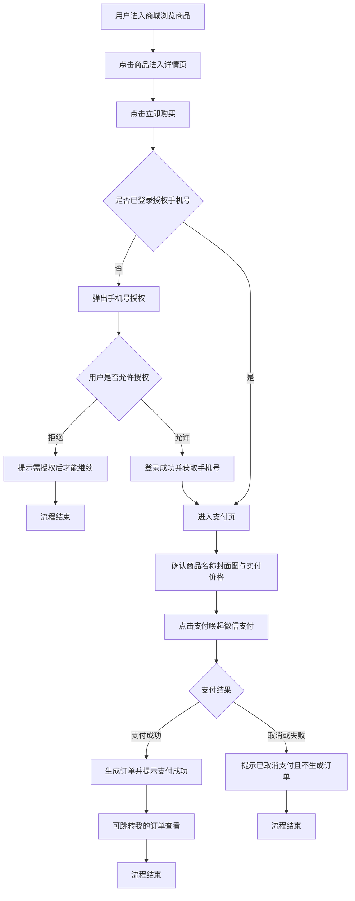
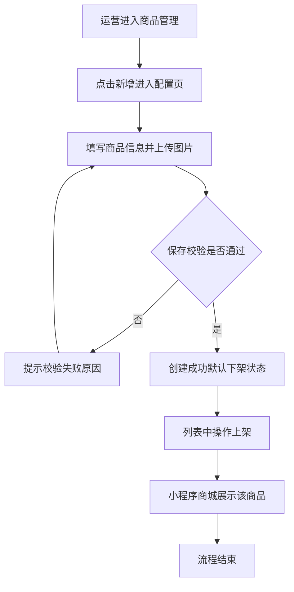

# PRD-1V1服务商城

## 一、修订记录

| 版本号 | 修改日期 | 修改原因 | 修订人 |
|--------|----------|----------|--------|
| v1.0   | 2026-09-08 | 初稿 | AI PRD Writer |

## 二、需求概述

- **背景/现状**：当前 1V1 服务商品无线上售卖渠道，用户购买依赖人工对接，订单无系统化管理。
- **需求目标**：在电销CRM管理后台新增「1V1服务」模块管理商品与订单，并在小程序「启思宇宙」上线商城，支持用户自助浏览、购买与查单。
- **核心逻辑简述**：后台配置并上架商品后，小程序商城展示该商品；用户授权手机号登录后通过微信支付完成购买，系统生成订单，后台与用户端均可查询。

## 三、术语表

| 术语 | 定义 |
|------|------|
| 商品实付价 | 用户实际支付的商品金额，不高于商品原价 |
| 手机号授权 | 用户在小程序内授权使用微信绑定手机号完成登录的过程 |

## 四、调整范围

1. 管理后台：新增一级菜单「1V1服务」，下设二级菜单「商品管理」「订单管理」。
2. 管理后台-商品管理：商品列表、筛选、新增/编辑配置页、上/下架、删除、查看详情。
3. 管理后台-订单管理：订单列表与多条件筛选。
4. 小程序「启思宇宙」：新增底部两个菜单「商城」「我的」。
5. 小程序-商城：商品卡片列表、名称搜索、商品详情页、购买支付流程。
6. 小程序-我的：头像与账号信息、手机号授权登录/退出登录、我的订单列表。

## 五、业务流程图

**用户购买支付流程**

**后台商品配置与上架流程**

## 六、可交互原型

在线预览：[点击查看可交互原型](https://pages.yc345.tv/yping-c78bba/1v1-service-mall/)

> 原型为可交互 HTML 页面，点击链接即可在浏览器中体验完整交互流程。原型顶部可切换「管理后台」与「用户端小程序」两个视图，两端数据联动。

本地原型文件：`需求汇总/1V1服务商城/prototype-1V1服务商城.html`

## 七、功能需求详细描述

### 7.1 【新增】管理后台-菜单

| 功能名称 | 功能类型 | 是否必填 | 交互说明 | 备注 |
|----------|----------|----------|----------|------|
| 一级菜单「1V1服务」 | 菜单 | 不适用 | 点击展开二级菜单 | 位于电销CRM系统侧边栏 |
| 二级菜单「商品管理」 | 菜单 | 不适用 | 点击进入商品列表页 | |
| 二级菜单「订单管理」 | 菜单 | 不适用 | 点击进入订单列表页 | |

### 7.2 【新增】管理后台-商品管理

**列表与筛选**

| 功能名称 | 功能类型 | 是否必填 | 交互说明 | 备注 |
|----------|----------|----------|----------|------|
| 商品名称筛选 | 文本输入 | 否 | 模糊搜索 | |
| 状态筛选 | 下拉选择 | 否 | 单选：全部/上架/下架 | 默认全部 |
| 新增按钮 | 按钮 | 不适用 | 点击跳转新增配置页 | |
| 上/下架操作 | 按钮 | 不适用 | 点击二次确认后切换状态；下架后小程序不再展示该商品 | 上架态展示「下架」，下架态展示「上架」 |
| 编辑操作 | 按钮 | 不适用 | 跳转配置页并回填商品信息 | |
| 删除操作 | 按钮 | 不适用 | 二次确认后删除，删除后不可恢复，小程序不再展示 | |
| 查看详情操作 | 按钮 | 不适用 | 弹窗展示商品全部配置字段 | |

**列表字段**

| 字段名称 | 字段说明 | 字段来源 | 备注 |
|----------|----------|----------|------|
| 商品名称 | 商品配置的名称 | 商品配置 | |
| 商品描述 | 商品配置的描述 | 商品配置 | 过长时省略展示 |
| 商品实付价格 | 用户实际支付金额 | 商品配置 | |
| 封面图 | 商品封面缩略图 | 商品配置 | |
| 状态 | 上架/下架 | 商品状态 | |
| 创建时间 | 商品创建时间 | 系统生成 | 列表按创建时间倒序 |
| 创建人 | 创建该商品的后台账号 | 系统生成 | |

**新增/编辑配置页字段**

| 字段名称 | 字段说明 | 字段来源 | 备注 |
|----------|----------|----------|------|
| 商品名称 | 文本输入 | 手动填写 | 必填 |
| 商品描述 | 多行文本 | 手动填写 | 必填，展示在小程序详情页 |
| 退费说明 | 多行文本 | 手动填写 | 必填，展示在小程序详情页 |
| 商品原价 | 金额输入 | 手动填写 | 必填 |
| 商品实付价 | 金额输入 | 手动填写 | 必填，不得高于商品原价 |
| 封面图 | 图片上传 | 手动上传 | 必填，1 张，展示在商城列表卡片 |
| 轮播图 | 图片上传 | 手动上传 | 必填，多张，展示在详情页顶部轮播 |
| 详情图 | 图片上传 | 手动上传 | 必填，多张，按顺序展示在详情页 |

**状态与校验**

| 涉及位置 | 变更动作 | 触发条件 | 系统行为 / 文案 |
|----------|----------|----------|------------------|
| 配置页保存按钮 | 新增 | 任一必填项为空或实付价高于原价 | 拦截保存并提示对应校验文案 |
| 商品状态 | 新增 | 新增保存成功 | 默认下架状态，需手动上架后小程序可见 |

### 7.3 【新增】管理后台-订单管理

**列表与筛选**

| 功能名称 | 功能类型 | 是否必填 | 交互说明 | 备注 |
|----------|----------|----------|----------|------|
| 订单号筛选 | 文本输入 | 否 | 精准搜索 | |
| 手机号筛选 | 文本输入 | 否 | 精准搜索 | |
| 商品名称筛选 | 文本输入 | 否 | 模糊搜索 | |
| 支付时间筛选 | 时间范围选择 | 否 | 起止时间，精确到年月日时分秒 | |
| 导出按钮 | 按钮 | 不适用 | 按列表展示字段导出订单数据；若已设置筛选条件，则按筛选后的结果导出 | 导出字段与列表字段一致：订单号、商品名称、实付价格、支付时间、支付手机号；筛选结果为空时提示无数据可导出 |

**列表字段**

| 字段名称 | 字段说明 | 字段来源 | 备注 |
|----------|----------|----------|------|
| 订单号 | 系统生成的唯一订单编号 | 支付成功生成 | |
| 商品名称 | 下单商品名称 | 订单快照 | |
| 实付价格 | 用户实际支付金额 | 订单快照 | |
| 支付时间 | 支付成功时间 | 系统生成 | 列表按支付时间倒序 |
| 支付手机号 | 下单用户授权的手机号 | 用户登录信息 | |

### 7.4 【新增】小程序「启思宇宙」-商城

| 功能名称 | 功能类型 | 是否必填 | 交互说明 | 备注 |
|----------|----------|----------|----------|------|
| 底部菜单「商城」「我的」 | 菜单 | 不适用 | 点击切换页面 | |
| 商品卡片列表 | 列表 | 不适用 | 卡片展示封面图、商品名称、原价（划线）/实付价 | 仅展示上架商品 |
| 商品名称搜索 | 文本输入 | 否 | 按商品名称筛选商品 | 无结果时展示空态文案 |
| 商品详情页 | 页面 | 不适用 | 展示商品名称、商品描述、退费说明、商品原价、商品实付价、封面图、轮播图、详情图 | 板块顺序：轮播图、商品信息、商品详情图、退费说明 |
| 立即购买按钮 | 按钮 | 不适用 | 未登录先走手机号授权；已登录携带手机号进入支付页 | |
| 支付页 | 页面 | 不适用 | 再次确认商品名称、封面图、实付价格；点击支付唤起微信支付 | |
| 微信支付 | 支付 | 不适用 | 支付成功生成订单并提示；取消或失败不生成订单 | |

### 7.5 【新增】小程序「启思宇宙」-我的

| 功能名称 | 功能类型 | 是否必填 | 交互说明 | 备注 |
|----------|----------|----------|----------|------|
| 默认头像与账号信息 | 展示 | 不适用 | 已登录展示脱敏手机号；未登录点击可授权手机号登录 | |
| 退出登录 | 按钮 | 不适用 | 二次确认后退出，恢复未登录态 | 仅登录态展示 |
| 我的订单 | 列表 | 不适用 | 展示订单编号、商品名称、支付价格、支付时间，按支付时间倒序 | 商品名称展示在卡片首行；未登录点击先走授权登录 |

### 7.6 状态与异常变更

| 涉及位置 | 变更动作 | 触发条件 | 系统行为 / 文案 |
|----------|----------|----------|------------------|
| 手机号授权弹窗 | 新增 | 用户点击拒绝 | 关闭弹窗并提示「需授权手机号后才能继续操作」 |
| 微信支付 | 新增 | 用户取消支付 | 提示「已取消支付」，不生成订单，停留在支付页 |
| 商城列表 | 新增 | 搜索无匹配商品或无上架商品 | 展示「暂无相关商品」空态 |
| 我的订单 | 新增 | 当前手机号无订单 | 展示「暂无订单」空态 |
| 商品详情页 | 新增 | 商品被下架或删除 | 展示「商品不存在或已下架」兜底文案 |

## 八、埋点与数据需求

（本期无）

## 九、权限说明

（本期无，沿用管理后台现有菜单权限体系）
