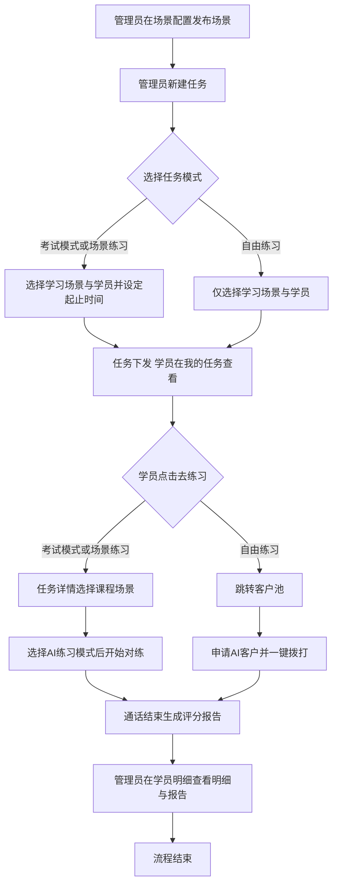
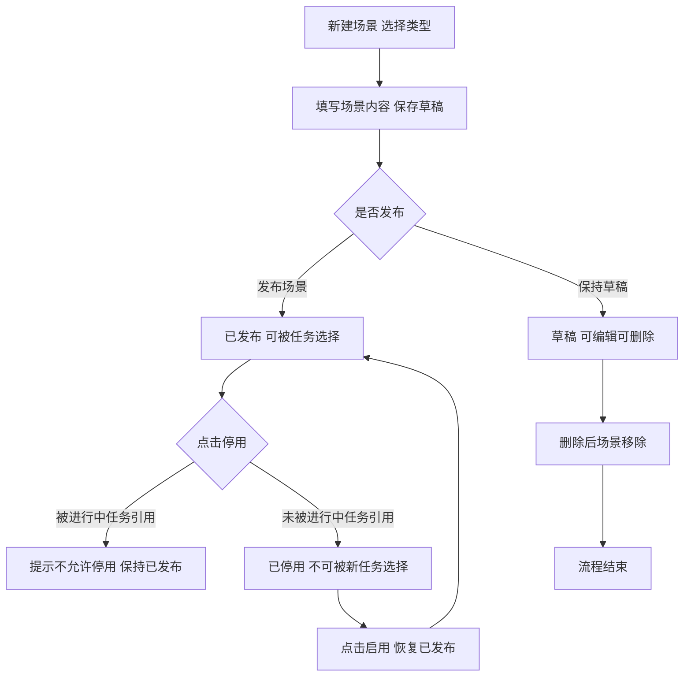
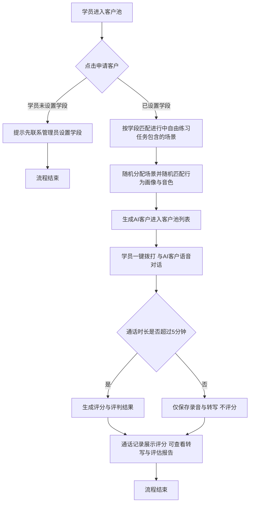

# PRD-AI质培中台-AI陪练模块

## 一、修订记录

| 版本号 | 修改日期 | 修改原因 | 修订人 |
|--------|----------|----------|--------|
| v1.0 | 2026-09-10 | 初稿 | AI PRD Writer |
| v1.1 | 2026-09-11 | 统一三页面角色身份取值（家长/学生/通用）；角色音色「类型」更名「角色身份」；补充 AI 客户生成规则说明；自由练习任务仅可选 AI客户场景；行为画像新增「挂断提示词」及 AI 主动挂断机制 | AI PRD Writer |
| v1.2 | 2026-09-14 | 行为画像库删除「基础难度（基础沟通难度）」字段 | AI PRD Writer |
| v1.3 | 2026-09-14 | 场景配置「评价标准」改为只读（由对练台配置管理统一维护）；评价输出仅保留分数、取消等级（评级） | AI PRD Writer |
| v1.4 | 2026-09-15 | 任务管理-添加学员面板新增姓名搜索直接添加（交互同学习项目-添加人员） | AI PRD Writer |
| v1.5 | 2026-09-15 | 客户池申请客户：存在多个进行中自由练习任务时，先下拉选择任务再申请 | AI PRD Writer |
| v1.6 | 2026-09-15 | 客户池列表新增「任务名称」字段，展示线索所属申请任务 | AI PRD Writer |
| v1.7 | 2026-09-15 | 客户池「任务名称」列移至操作栏前；线索所属任务结束后，列表与客户详情的「一键拨打」置灰不可点击 | AI PRD Writer |
| v1.8 | 2026-09-15 | 删除 AI 主动挂断"接通后 30 秒内不触发"限制 | AI PRD Writer |
| v1.9 | 2026-09-15 | 任务管理任务列表新增「创建人」字段 | AI PRD Writer |
| v1.10 | 2026-09-22 | 任务管理-学员明细（考试模式）展开表不展示「是否通过」字段 | AI PRD Writer |

## 二、需求概述

- **背景/现状**：AI 陪练能力目前分散在电销 CRM 的"AI陪练台"中，培训场景需要在 AI 质培中台内统一承接。
- **需求目标**：在 AI 质培中台新增一级菜单「AI陪练」，将电销 CRM 陪练能力迁移并扩展场景化、自由练习等新能力。
- **核心逻辑简述**：管理员维护场景/画像/音色并下发任务；学员按任务模式练习或在客户池自由外呼，通话由 AI 扮演客户并自动评分。

## 三、术语表

| 术语 | 定义 |
|------|------|
| AI客户场景 | 由 AI 扮演客户进行完整外呼对话练习的场景类型 |
| 问答对练场景 | 学员依次回答预设问题、按标准答案匹配度评分的场景类型 |
| 行为画像 | 只描述客户沟通行为（配合度、语气、披露节奏等）的可复用配置，不含身份/学段等固定事实 |
| 学段 | 坐席的固定服务学段（小学/初中/高中），用于自由练习匹配场景 |
| 自由练习 | 不限定进度的任务模式，学员通过客户池申请 AI 客户自主外呼练习 |
| 客户池 | 存放学员已申请的 AI 模拟客户的列表页面 |

## 四、调整范围

在 AI 质培中台新增一级菜单「AI陪练」，含 8 个二级菜单（按菜单顺序）：

| 页面 | 建设方式 |
|------|----------|
| 优秀话术库 | 整页复用电销 CRM「优秀话术库」 |
| 场景配置 | 新增页面（融合 CRM 课程管理与 AI 陪练台场景库能力） |
| 行为画像库 | 新增页面 |
| 对练台配置管理 | 整页复用电销 CRM「对练台配置管理」 |
| 角色音色管理 | 复用电销 CRM「角色音色管理」+ 新增角色身份字段 |
| 任务管理 | 参考电销 CRM「任务管理」重建，含多项新逻辑 |
| 我的任务 | 参考电销 CRM「我的任务」重建，新增自由练习入口 |
| 客户池 | 新增页面 |

另涉及：系统管理-用户管理页面新增「学段」字段（编辑/批量编辑）。

## 五、业务流程图

**流程一：任务下发与学员练习主流程**

**流程二：场景状态流转**

**流程三：自由练习客户池外呼与评分**

## 六、可交互原型

在线预览：[点击查看可交互原型](https://pages.yc345.tv/yping-c78bba/ai-practice-training-platform/)

> 原型为可交互 HTML 页面，点击链接即可在浏览器中体验完整交互流程（左侧菜单可切换全部页面，按钮均可点击演示）。

## 七、功能需求详细描述

> 本模块整体为新增，以下按页面呈现。整页复用的页面只写复用说明；其余页面详细描述功能逻辑与字段限制。

### 7.1 优秀话术库（整页复用）

【新增-复用】整页复用电销 CRM「AI陪练台-优秀话术库」的全部功能与交互，包括：问题/答案搜索模式、关键词搜索、标签选择弹窗（按标签组勾选、每组默认展示 10 个可展开、已选标签按"组名: 标签名"展示可删除）、左侧分类树（含分类名称搜索）、话术卡片列表（标准问题/标准答案/分类路径超 15 字截断悬浮/相似问法个数/生效时间/标签最多展示 4 个超出折叠）、问题详情只读弹窗、完整分页器。

- 前端按 AI 质培中台样式重新实现，交互逻辑不变；后端做代码迁移即可，数据仍来源于现有知识库。
- 本页为只读浏览，无新增/编辑能力。

### 7.2 场景配置（新增页面）

#### 7.2.1 场景列表

| 字段 | 说明 |
|------|------|
| 场景名称 | 点击进入只读详情 |
| 类型 | AI客户 / 问答对练（角标展示） |
| 适用学段 | 小学/初中/高中，可多选展示 |
| 客户身份范围 | 家长/学生/通用（仅 AI客户类型有值，问答对练展示"—"） |
| 标签 | 场景关联的标签集合 |
| 发布状态 | 已发布（绿）/ 草稿（灰）/ 已停用（红） |
| 更新人 | 最后一次保存/发布/状态变更的操作人 |
| 更新时间 | 最后变更时间 |

筛选项：场景名称搜索、发布状态下拉、学段下拉、标签下拉（标签来源为标签管理）。

**操作栏规则（按发布状态区分）：**

| 发布状态 | 可用操作 | 规则说明 |
|----------|----------|----------|
| 已发布 | 编辑、停用 | 停用前校验：若该场景被**进行中**的任务引用，弹出提示"该场景正在被进行中的任务引用，不允许停用"，停用失败；未被引用则停用成功 |
| 草稿 | 编辑、删除 | 删除需二次确认；删除后场景从列表移除，不可恢复 |
| 已停用 | 启用 | 启用后恢复为已发布，可重新被任务选择 |

- 已停用/草稿状态的场景不出现在任务管理"选择场景"面板中（面板仅可选"已发布"场景）。
- 点击**场景名称**打开只读详情抽屉，展示该场景全部配置内容，只可查看不可修改。

#### 7.2.2 新建场景（两步）

**第一步：选择场景类型**。点击「新建场景」弹出类型选择弹窗，两张卡片：AI客户（与 AI 客户对话练习）、问答对练（问答方式训练异议处理）；未选中时「确认」按钮禁用，选中后高亮并可确认。

**第二步：场景内容配置（新开页面）**。确认类型后跳转独立配置页（非弹窗），字段与电销 CRM「课程管理-新建课程」保持一致。页面右上角操作：保存草稿、发布场景；顶部返回按钮回到列表。

**公共字段：**

| 字段 | 必填 | 限制说明 |
|------|------|----------|
| 场景名称 | 是 | 文本输入，不超过 20 个字符 |
| 适用学段 | 是 | 复选：小学/初中/高中，至少选一项；任务与自由练习只会匹配学员固定学段包含在内的场景 |
| 场景标签 | 否 | 下拉选择，选项来源于标签管理；可多选，可删除已选标签 |

**AI客户类型专属字段：**

| 字段 | 必填 | 限制说明 |
|------|------|----------|
| 客户身份范围 | 是 | 单选：家长/学生/通用；家长可生成父亲、母亲、爷爷或奶奶，学生可生成男学生或女学生，通用可生成家长或学生；与行为画像「适用身份范围」、角色音色「角色身份」的身份取值保持一致 |
| 对话时间上限 | 是 | 数字输入，1~9999 分钟；到达上限按通话结束流程处理 |
| 对话间隔时长 | 是 | 数字输入，1~999 秒；对练时给销售侧回复倒计时引导，避免等待过久 |
| 场景提示词 | 是 | 多行文本；写明电话背景、场景发生原因、训练流程、禁止行为、客户信息披露节奏；客户角色与音色不在场景中绑定，由行为画像与角色音色在生成客户时动态匹配 |
| 对话目标 | 是 | 多行文本，描述本场景的训练目标 |
| 评价标准 | — | **只读展示，不可修改**；内容为对练台配置管理中的"对练评价默认模板"，仅供查看 |

**问答对练类型专属字段：**

| 字段 | 必填 | 限制说明 |
|------|------|----------|
| 对话时间间隔 | 是 | 数字输入，1~9999 秒 |
| 选择问题 | 是 | 至少选择 1 个问题，上限 40 个；选题面板交互同"学习项目-选择课程"：支持问题关键词搜索、分类下拉筛选，仅可选择优秀话术库中已生效的问题，复选后"确定添加"；已选问题以表格展示（排序/问题/答案/删除），支持拖拽调整顺序，学员按顺序作答 |
| 对话目标 | 是 | 多行文本 |
| 评价标准 | — | **只读展示，不可修改**；内容为对练台配置管理中的"问答对练评价模板"，仅供查看 |

**编辑限制：**
- 场景类型创建后不可修改；
- 已发布场景编辑保存后立即生效，正在进行中的通话不受影响，新发起的练习使用新配置；
- 已停用场景不可编辑（需先启用）。

#### 7.2.3 标签管理

列表页「标签管理」按钮打开抽屉，交互等同质培中台"课程管理-分类管理"：

| 功能 | 规则说明 |
|------|----------|
| 添加标签 | 展开表单面板输入标签名称，不超过 20 个字符；名称不可与现有标签重复，重复时提示"标签名称不可与现有标签重复" |
| 列表展示 | 标签名称、引用场景数、添加人、添加时间；按添加时间倒序 |
| 行内编辑 | 点击"编辑"当前行变为输入框，保存/取消 |
| 删除 | 仅"引用场景数为 0"的标签展示删除按钮；删除需二次确认；被场景引用的标签需先在场景中移除后才可删除 |

标签的增删改实时同步到：场景列表的标签筛选下拉、场景编辑页的标签选择下拉。

### 7.3 行为画像库（新增页面）

#### 7.3.1 画像列表

| 字段 | 说明 |
|------|------|
| 画像名称 | 点击进入只读详情（只可看不可改） |
| 适用身份范围 | 家长 / 学生 / 通用 |
| 发布状态 | 已发布 / 草稿 / 已停用 |
| 更新人 | 最后变更操作人 |
| 更新时间 | 最后变更时间 |

筛选项：画像名称搜索、适用身份范围下拉、发布状态下拉。

**操作栏规则：** 与场景一致——已发布：编辑、停用；草稿：编辑、删除（二次确认）；已停用：启用。

#### 7.3.2 新建/编辑画像

| 字段 | 必填 | 限制说明 |
|------|------|----------|
| 画像名称 | 是 | 文本输入，上限 20 字符 |
| 适用身份范围 | 是 | 单选：家长/学生/通用；通用可匹配任意客户身份，家长/学生用于限制匹配候选；与场景配置「客户身份范围」、角色音色「角色身份」的身份取值保持一致 |
| 行为提示词 | 是 | 多行文本，直接手动输入（无模板/示例/AI 生成辅助按钮），上限 12000 字；只描述配合程度、沟通风格、信息披露、信任决策、质疑与情绪反应；禁止写入身份、学段、年级、地区、职业、会员、订单等固定事实 |
| 挂断提示词 | 否 | 多行文本，上限 2000 字；描述 AI 客户**主动挂断**的判断条件与结束语风格（如：被连续强行推销、多轮答非所问、已明确拒绝仍被纠缠时，不耐烦地说一句结束语后挂断）；留空表示该画像的客户不会主动挂断；**仅对自由练习场景下的 AI客户类型生效** |

- 画像不绑定具体场景；客户池申请客户、任务练习时按"适用身份范围与场景客户身份范围匹配"动态选取。
- 配置了挂断提示词的画像，对练时挂断提示词随行为提示词一并注入对练模型；由模型根据对话内容自行判定是否挂断，判定挂断时输出结束语并附加挂断标记，系统识别标记后按"客户挂断"流程结束通话（触发保护规则与通话表现见 7.8.3）。

### 7.4 对练台配置管理（整页复用）

【新增-复用】整页复用电销 CRM「AI陪练台-对练台配置管理」功能：对练模型选择、对练评价模型选择（模型选项来源于 AI 资源配置）、对练评价默认模板、问答对练评价模板，保存后全局生效。

- 前端按 AI 质培中台表单样式重新实现（分组区块、统一控件宽度、字段说明文案），功能逻辑不变；后端做代码迁移即可。

### 7.5 角色音色管理（复用 + 增量）

【新增-复用】列表与新增/编辑弹窗复用电销 CRM「角色音色管理」：角色ID、角色名称、音色ID、操作（编辑）；弹窗含角色名称（上限 10 字符）、音色ID（1~100 字符）+「试听」按钮；新增时按钮文案"新增"、编辑时"保存"。前端改用质培中台样式，后端迁移。

【新增】增量变更：

| 变更 | 说明 |
|------|------|
| 列表新增「角色身份」字段 | 取值：家长/学生，标签展示 |
| 新增/编辑弹窗新增「角色身份」必填下拉 | 家长/学生二选一；编辑时回填已有角色身份 |

- 角色身份用于生成 AI 客户时按场景客户身份范围匹配音色：家长身份仅匹配"家长"角色身份的音色，学生身份仅匹配"学生"角色身份的音色；与场景配置「客户身份范围」、行为画像「适用身份范围」的身份取值保持一致。

### 7.6 任务管理（参考 CRM 重建 + 新逻辑）

以电销 CRM「任务管理」为基础，含以下调整。

#### 7.6.1 任务列表

| 字段 | 说明 |
|------|------|
| 任务ID | 系统生成 |
| 任务名称 | — |
| 学员人数 | 展示该任务所选学员的人数（数字链接），点击进入"学员明细"子页面（原 CRM 为"查看学员"文案，本次改为人数展示） |
| 任务状态 | 未开始 / 进行中 / 已结束 |
| 任务模式 | 自由练习 / 场景练习 / 考试模式（支持下拉筛选） |
| 创建人 | 任务的创建者，创建后不变（筛选项"创建人模糊搜索"即按此字段匹配） |
| 更新人 | — |
| 创建时间 / 开始时间 / 截止时间 | — |

筛选项：任务名称搜索、任务执行状态下拉、创建人**文本输入模糊搜索**、任务模式下拉。

**操作栏规则：**

| 任务状态 | 可用操作 | 说明 |
|----------|----------|------|
| 未开始 | 编辑、删除 | 删除需二次确认；删除后任务与下发关系一并移除 |
| 进行中 | 编辑、结束 | 结束需二次确认；结束后学员不可再练习 |
| 已结束 | 无 | 展示"—" |

#### 7.6.2 新建/编辑任务

| 字段 | 必填 | 限制说明 |
|------|------|----------|
| 任务名称 | 是 | 不超过 20 个字符，带字数统计 |
| 任务模式 | 是 | 单选：自由练习（不限进度，学员经客户池自主外呼）/ 场景练习（有效期内可多次练习并记录每次成绩）/ 考试模式（有效期内仅单次练习）；**编辑任务时不允许修改** |
| 学习场景 | 是 | 至少选择 1 个；点击「选择场景」展开面板：支持场景名称搜索、**按标签下拉筛选**，表格展示场景名称、**类型（AI客户/问答对练）**、适用学段、标签，表头支持**全选**（按当前筛选结果全选）；仅可选择"已发布"场景；**任务模式为自由练习时，选择场景面板仅可选择 AI客户类型的场景，问答对练场景不可选**；已选场景列表支持拖拽排序，学员按顺序练习；**编辑时不可删除已下发场景，仅可追加** |
| 学员 | 是 | 「添加学员」按钮右侧提供**姓名搜索输入框**（placeholder"搜索姓名直接添加人员"，旁附说明"支持按人员或按组织批量选择"）：输入姓名弹出匹配人员下拉（展示"姓名（所属组织）"及已添加状态），点击即直接添加为学员，**交互与质培中台「学习项目-添加人员」保持一致**；点击「添加学员」展开组织架构选人面板（左侧架构树+右侧人员复选+全选，底部显示已选人数）按组织批量选择；**编辑时不可删除已下发学员，仅可追加** |
| 起止时间 | 是 | 日期时间范围；结束时间必须晚于开始时间；到达截止时间后学员无法再练习；**编辑任务时不允许修改** |
| 任务提醒 | 是 | 单选：不提醒（默认）/ 单次提醒 / 周期提醒 |
| 提醒时间（单次） | 条件必填 | 仅"单次提醒"时展示；只能选择未来时间且晚于当前时间 10 分钟以上 |
| 提醒时间（周期） | 条件必填 | 仅"周期提醒"时展示；周一~周日各一个时间选择，至少设置一天 |

#### 7.6.3 学员明细（子页面）

从任务列表点击学员人数进入，头部展示任务名称、任务模式、任务状态、起止时间；右上角「导出明细」，任务已结束时展示「查看任务报告」。

**学员列表字段：** 学员、所属组织、完成进度（进度条）、最近练习时间、综合得分、操作（查看明细、查看报告）。不展示在职状态。

| 操作 | 交互说明 |
|------|----------|
| 查看明细 | **在当前行下方以表格内展开形式呈现**（非弹窗），按钮文案切换为"收起明细"；同一时间仅展开一行（手风琴式）。明细内容随任务模式变化：自由练习=每条线索的练习情况（线索昵称/手机号/练习场景/练习次数/累计时长/最近练习时间）；场景练习=每个场景的练习情况（场景名称/完成状态/练习次数/最高得分/最近练习时间）；考试模式=每个场景的考试情况（场景名称/考试状态/得分/考试时间）。每行含「查看报告」 |
| 明细内查看报告 | 右侧抽屉浮出，左右分栏：左侧"通话记录"=录音播放条（进度/音量/倍速/下载）+按时间戳的完整对话转写气泡（每句可单独播放）；右侧"对话评估报告"=任务得分（红色突出，**仅展示分数，不展示等级**）、评估结果（得分明细加总公式、总分）、逐环节得分点（评判标准 A/B/C/D 级定义+当前判断依据及得分）、改进建议；考试模式额外展示考核结果（通过/未通过） |
| 学员级查看报告 | 右侧抽屉展示该学员**整体**评价与分析：综合得分/完成进度指标卡、能力维度分析（开场破冰/需求挖掘/产品介绍/异议处理/促单关单条形评分）、优势表现、待改进项、AI 综合评语与建议 |

### 7.7 我的任务（参考 CRM 重建 + 新逻辑）

**列表字段：** 任务名称、任务状态、任务模式（可筛选）、进度、开始时间、截止时间、操作。搜索：任务名称、任务执行状态（进行中/已结束）。

**进度与操作规则：**

| 任务模式 | 进度展示 | 操作 |
|----------|----------|------|
| 自由练习 | 不展示进度（"—"） | 统一展示「去练习」，点击**跳转客户池页面** |
| 场景练习 / 考试模式 | 已完成数/总数 进度条 | 进行中且未完成=「去练习」；已完成或任务已结束=「详情」；均打开任务详情弹窗 |

**任务详情弹窗（交互同 CRM）：** 课程卡片列表，每张卡片含场景名称、类型角标（AI客户/问答对练）、已完成标签、"得分 X 分"、练习说明（超长截断悬浮）：

| 场景 | 按钮规则 |
|------|----------|
| 考试模式-未完成 | 「开始练习」 |
| 考试模式-已完成 | 「详情」（查看评分） |
| 场景练习-已完成 | 展示"共练习 N 次"+练习记录下拉（第N次练习（得分））+「详情」+「开始第 N+1 次练习」 |
| 场景练习-未完成 | 「开始第 1 次练习」 |
| 任务已结束-未完成 | 红色"未完成"文案，无按钮 |

**选择AI练习模式弹窗（交互同 CRM）：** 点击开始练习后弹出。语音+文本对练（默认选中：语音合成/文本显示/完整体验）、纯文本对练（纯文本/快速响应/高效练习）；**考试模式下纯文本对练禁用**，文案提示"考试模式下不支持纯文本对练，仅支持语音对练模式"；底部提示"销售侧在进行对练时，仍需要通过发送语音进行对练"；确认后进入对练界面。

**AI客户生成规则（三种任务模式通用）：** 学员练习 **AI客户类型场景**时，系统均以该场景配置的「客户身份范围」为准，从"已发布"行为画像中随机选取一个**角色身份一致**的画像（通用画像可匹配任意身份），并从角色音色管理中随机选取一个**角色身份一致**的音色，组合生成一个最终的 AI 客户进行练习。其中：自由练习在客户池「申请客户」时生成（见 7.8.2）；场景练习、考试模式在学员点击「开始练习」时生成。

### 7.8 客户池（新增页面）

#### 7.8.1 客户列表

| 字段 | 说明 |
|------|------|
| 洋葱ID | 点击进入客户详情 |
| 手机号 | — |
| 最近一次付费时间 | 可为空（"—"） |
| 最近一次看课时间 | 可为空 |
| 意向度 | 高/中/低 标签，可为空 |
| 领取时间 | 申请客户的时间 |
| 任务名称 | 该线索经哪个自由练习任务申请生成（即申请客户时所选任务）；位于操作栏之前，任务已结束时附"已结束"标签 |
| 操作 | 一键拨打、查看详情；**线索所属任务到达结束时间后，「一键拨打」置灰不可点击**（悬浮提示"所属任务已结束，无法拨打"），查看详情不受影响 |

#### 7.8.2 申请客户

页面右上角「申请客户」按钮：

| 规则 | 说明 |
|------|------|
| 前置校验 | 当前登录学员须已设置学段（用户管理维护）；未设置时提示联系管理员设置后再申请 |
| 任务选择 | 点击「申请客户」时，若学员存在**多个**"当前时间处于有效期内、且包含该学员的进行中自由练习任务"，先以**下拉形式展开任务列表（展示任务名称）**，学员选择其中一个任务后再执行申请；仅一个任务时直接申请，无任务时提示无法申请 |
| 场景匹配 | 从**所选任务**所含场景中，筛选适用学段包含学员学段的**已发布**场景，随机分配一个 |
| 画像匹配 | 按场景的客户身份范围，从"已发布"行为画像中随机匹配一个**角色身份一致**的画像（通用画像可匹配任意身份） |
| 音色匹配 | 按客户身份从角色音色管理中随机匹配**角色身份一致**（家长/学生）的音色 |
| 客户生成 | 生成一个 AI 模拟客户进入列表顶部；客户资料（昵称、所在地、手机号、年级、洋葱ID、注册时间、是否会员、客户类型、看课/付费时间、意向度）随机生成，字段允许为空；领取时间为申请时刻 |

#### 7.8.3 一键拨打（AI 外呼）

- 通话窗以**右上角悬浮弹窗**展示，不遮挡页面；支持「收起」为悬浮胶囊条（客户昵称+实时计时+展开/挂断），收起后可继续浏览页面（含客户详情），计时不中断。
- 通话窗左侧：客户头像（接通后呼吸圈动效）、昵称、手机号、状态（正在拨号…→通话中）、计时、挂断按钮；右侧：实时通话转写（双方气泡+时间线）与输入区。
- **语音对话**：支持「开启语音通话」——授权麦克风后学员直接说话，语音实时识别转写并自动发送；AI 客户回复自动语音播报（播报期间暂停收音，播完自动恢复），模拟真实电话节奏；也可打字发送。
- AI 客户按"场景提示词+行为画像+音色"扮演客户应答。
- **AI 主动挂断**：当匹配到的行为画像配置了「挂断提示词」（见 7.3.2）时，AI 客户会依据提示词中的判断条件在通话中主动挂断——AI 说完结束语后，转写区出现系统提示"对方已挂断"，通话状态变为"已挂断"，随后自动按挂断流程结算。保护规则：每通电话最多触发一次；触发后学员不可再发送消息。被挂断通话的录音、转写保存与评分规则不变（仍按 7.8.4 执行），通话结果记为"客户挂断"。

#### 7.8.4 通话评分规则

| 条件 | 系统行为 |
|------|----------|
| 通话时长 > 5 分钟 | 挂断后自动生成评分与评判结果，评分展示在通话记录列表 |
| 通话时长 ≤ 5 分钟 | 仅保存录音与转写，不评分；列表评分列展示"—"，查看转写时右侧提示"本次通话未参与评分（未达 5 分钟评分门槛）" |

#### 7.8.5 客户详情

从列表"查看详情"或洋葱ID进入，展示效果参考电销 CRM 客户详情：顶部客户信息描述表（客户昵称、所在地、用户手机号、年级、用户洋葱ID、注册时间、是否为会员、客户类型、最近一次看课时间、最近一次付费时间、意向度），右上角「一键拨打」（**线索所属任务到达结束时间后同样置灰不可点击**，悬浮提示"所属任务已结束，无法拨打"）；下方四个页签：

| 页签 | 内容 | 数据规则 |
|------|------|----------|
| 订单记录 | 订单号、商品名称、订单金额、支付时间、订单状态 | 随机生成，可为空态 |
| 观看记录 | 视频名称、知识点名称、观看时间 | 系统预置"学段×科目"默认视频库（小学：语文/数学/英语；初中、高中：语文/数学/英语/物理/化学/生物/地理/历史/道德与法治，每个学段+科目默认 10 条视频名称+知识点名称），按客户年级对应学段跨科目随机抽取生成；可为空态 |
| 学情报告 | 科目、题目准确率（进度条）、学习时长 | 科目按学段区分随机生成；无年级时为空态 |
| 通话记录 | 通话时间、通话时长、通话结果（已接通/**客户挂断**）、**挂断方**（销售/AI客户）、**评分**、操作（查看转写） | 真实记录学员拨打行为，不随机；AI 主动挂断的通话结果展示"客户挂断"（红色标签）、挂断方展示"AI客户"（红色标签），学员主动挂断的挂断方展示"销售"；评分按 7.8.4 规则展示 |

「查看转写」打开右侧抽屉：左侧语音转文字（录音播放条+对话气泡逐句播放），右侧展示评分评判结果（同 7.6.3 报告结构）或"未参与评分"提示。

### 7.9 用户管理（系统管理，增量修改）

在现有用户管理页面基础上：

【新增】列表新增「学段」字段：小学/初中/高中标签展示，未设置显示"-"。

【修改】编辑弹窗：改前=仅可编辑角色；改后=在角色下方新增「学段」下拉（未设置/小学/初中/高中），可不选；说明文案"学段用于自由练习任务申请客户时匹配对应学段的场景，未设置时无法申请 AI 客户"。

【新增】「批量编辑学段」按钮：勾选用户后点亮（按钮带已选人数）；弹窗结构同现有批量编辑角色——"已选坐席"限高滚动框展示"姓名（当前学段）"，"调整为"下拉选择学段；保存后所选坐席学段**统一覆盖**为所选值（非追加）；单次批量上限 50 人。

## 八、埋点与数据需求

（本期无明确埋点需求）

## 九、权限说明

| 页面 | 权限说明 |
|------|----------|
| 场景配置、行为画像库、对练台配置管理、角色音色管理、任务管理 | 管理员/培训师角色可见可操作，沿用质培中台现有菜单权限体系 |
| 优秀话术库、我的任务、客户池 | 全员可见；客户池仅展示当前登录学员自己申请的客户 |
| 用户管理-学段编辑/批量编辑 | 沿用现有用户编辑权限 |
