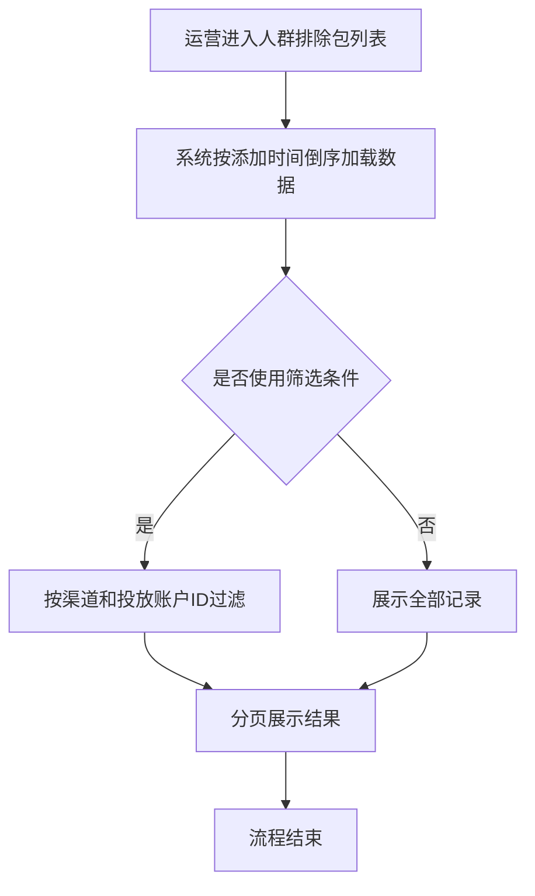
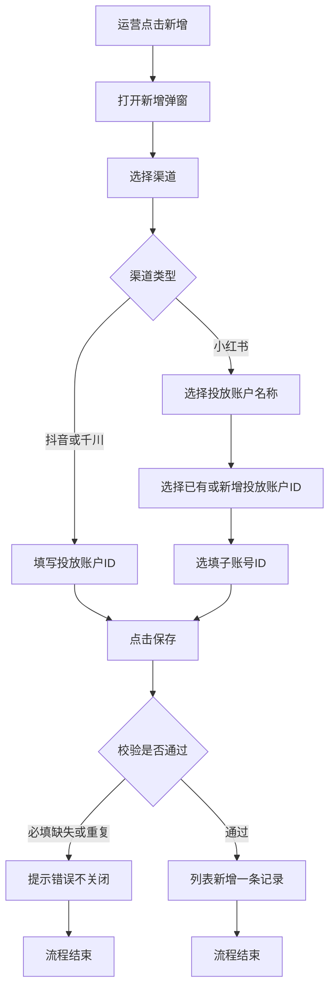

# PRD-人群排除包

## 一、修订记录

| 版本号 | 修改日期 | 修改原因 | 修订人 |
|--------|----------|----------|--------|
| v1.0   | 2026-09-22 | 初稿 | AI PRD Writer |
| v1.1   | 2026-09-22 | 小红书已接入自动推排除包的账户名称与投放账号ID初始化为可选枚举 | AI PRD Writer |
| v1.2   | 2026-09-22 | 子账号ID改为选填；每新增一个子账号即新增一条列表记录 | AI PRD Writer |

## 二、需求概述

- **背景/现状**：WHEN 运营在体验营 CRM 配置投放侧人群排除时，IF 缺少统一的排除包管理入口，THEN 无法按渠道沉淀可复用的排除账户配置。
- **需求目标**：WHEN 运营进入运营工具，THEN 可通过「人群排除包」列表查询、分页浏览，并按渠道规则新增排除配置。
- **核心逻辑简述**：按渠道分支录入；抖音/千川仅配置投放账户ID；小红书先选已接入账户名称并带出投放账号ID，子账号ID选填；每保存一次新增一条列表记录，同一投放账户下不同子账号各占一行。

## 三、术语表

| 术语 | 定义 |
|------|------|
| 人群排除包 | 用于在投放侧排除指定账户人群的配置记录 |
| 渠道 | 投放来源，本次支持抖音、千川、小红书 |
| 投放账户ID | 投放平台侧的广告主/投放账户唯一标识 |
| 子账号ID | 小红书场景下挂在投放账户下的子账号标识 |
| 投放账户名称 | 小红书场景下用于选择已有投放账户的名称，枚举取已接入自动推排除包的账户 |
| 投放账号 ID | 小红书聚光投放账户数字标识，与投放账户名称一一对应 |

## 四、调整范围

1. 体验营 CRM 后台 → 运营工具：新增二级菜单「人群排除包」。
2. 人群排除包列表页：字段展示、按添加时间倒序、分页、渠道与投放账户ID筛选。
3. 新增弹窗：按渠道分支录入；抖音/千川与小红书字段与校验规则不同。
4. 小红书投放账户名称、投放账户ID：初始化「已接入自动推排除包」账户为可选枚举。
5. 保存时的重复校验与提示。
6. 本次不包含编辑、删除、批量导入导出、权限细分与埋点；未接入自动推包的小红书账户不进入本期枚举。

## 五、业务流程图

**列表查询与分页**

**新增排除包**

## 六、可交互原型

在线预览：[点击查看可交互原型](https://pages.yc345.tv/yping-c78bba/audience-exclusion-package/)

> 原型为可交互 HTML 页面，可体验列表筛选、分页及按渠道分支的新增与重复校验。

本地原型文件：`需求汇总/人群排除包/prototype-人群排除包.html`

## 七、功能需求详细描述

#### 7.1 【新增】功能

**功能 / 按钮 / 弹窗类**

| 功能名称 | 功能类型 | 是否必填 | 交互说明 | 备注 |
|----------|----------|----------|----------|------|
| 运营工具-人群排除包 | 二级菜单 | 不适用 | 点击进入人群排除包列表页 | 挂在运营工具下 |
| 渠道筛选 | 下拉选择 | 否 | 选项：全部、抖音、千川、小红书；变更后结合查询刷新列表 | 默认全部 |
| 投放账户ID筛选 | 文本输入 | 否 | 精准匹配投放账户ID；支持查询/重置 | 空则不按该条件过滤 |
| 查询 / 重置 | 按钮 | 不适用 | 查询按当前条件刷新；重置清空条件后刷新 | 分页回到第一页 |
| 新增 | 按钮 | 不适用 | 打开新增弹窗 | 列表右上角 |
| 新增弹窗-渠道 | 下拉单选 | 是 | 枚举：抖音、千川、小红书；切换后重置后续字段 | 未选渠道时其余业务字段不展示 |
| 新增弹窗-投放账户ID | 文本输入 | 是 | 仅渠道为抖音或千川时展示 | 保存后列表账户名、子账号ID展示为「-」 |
| 新增弹窗-投放账户名称 | 下拉选择 | 是 | 仅小红书展示；选项为下表「小红书已有账户」中的投放账户名称 | 选中后展示该名称对应的已有投放账户ID，以及选填的子账号ID |
| 新增弹窗-投放账户ID | 选择已有 / 新增 | 是 | 小红书：已有选项为所选名称对应的投放账号 ID；也可新增 | 新增ID保存成功后进入该账户已有ID集合 |
| 新增弹窗-子账号ID | 文本输入 | 否 | 仅小红书、选中账户名称后展示；可不填 | 填写后保存为一条新记录；同一投放账户ID下每新增一个子账号ID，列表多一行；未填时列表展示「-」 |
| 保存 / 取消 | 按钮 | 不适用 | 保存校验通过后落库并关闭弹窗刷新列表；取消关闭不保存 | 保存成功提示「保存成功」 |

**列表字段类**

| 字段名称 | 字段说明 | 字段来源 | 备注 |
|----------|----------|----------|------|
| 渠道 | 配置所属渠道 | 新增时选择 | 抖音 / 千川 / 小红书 |
| 账户名 | 投放账户名称 | 小红书取所选账户名称；抖音/千川为空展示「-」 | — |
| 投放账户ID | 投放账户唯一标识 | 新增时录入或选择 | — |
| 子账号ID | 小红书子账号标识 | 新增时选填；未填或抖音/千川展示「-」 | 同一投放账户下不同子账号各占一行 |
| 添加人 | 保存时的操作人 | 当前登录用户 | — |
| 添加时间 | 保存成功时间 | 系统生成 | 列表默认按此字段倒序 |

**小红书已有账户（初始化枚举）**

来源：已接入自动推排除包的小红书账户。新增弹窗中「投放账户名称」下拉、选择「已有」时的「投放账户ID」均取本表，不可自造名称。

| 投放账户名称 | 投放账号 ID | 接入方式 | 说明 |
|----------|----------|----------|------|
| 汇咚-洋葱星球线上体验-私信-01 | 10992810 | 独立 DMP 账户 | 选择该名称后，已有投放账户ID为 10992810 |
| 引潮-洋葱星球线上体验-私信-01 | 9209069 | 独立 DMP 账户 | 选择该名称后，已有投放账户ID为 9209069 |
| 聚才-洋葱星球线上体验-私信-01 | 9648085 | 独立 DMP 账户 | 选择该名称后，已有投放账户ID为 9648085 |
| 蜜橘-洋葱学园线上体验-私信-03 | 8310560 | 独立 DMP 账户 | 选择该名称后，已有投放账户ID为 8310560 |
| JX-洋葱学园线上体验-私信-01 | 8311339 | 独立 DMP 账户 | 选择该名称后，已有投放账户ID为 8311339 |
| JX-洋葱学园线上体验-私信-04 | 8310363 | 子账户 | 归属 JX-洋葱学园线上体验-私信-01（8311339）；子账号ID仍为选填 |
| 灵犀-洋葱学园家长帮-私信-01 | 11839535 | 独立 DMP 账户 | 选择该名称后，已有投放账户ID为 11839535 |
| 灵犀-洋葱学园家长帮-私信-02 | 12083727 | 独立 DMP 账户 | 选择该名称后，已有投放账户ID为 12083727 |

- 名称与 ID 一对一：选中名称后，已有投放账户ID仅展示该行对应值。
- 允许在该名称下新增投放账户ID；新增成功后，该名称的已有 ID 列表增加此项。
- 子账号ID选填。每保存一次新增一条列表记录；同一投放账户ID填写不同子账号ID时，分别各占一行，不覆盖已有行。
- 未接入自动推排除包的小红书账户不进入本期枚举。

**列表与分页规则**

| 规则项 | 说明 |
|--------|------|
| 默认排序 | 按添加时间倒序 |
| 分页 | 提供分页控件，沿用现有后台分页交互 |
| 筛选组合 | 渠道与投放账户ID可同时生效；投放账户ID为空不作为过滤条件 |
| 列表粒度 | 一条记录对应一次保存；同一投放账户ID + 不同子账号ID = 多条记录 |

**重复校验规则**

| 渠道 | 判重维度 | 重复时行为 |
|------|----------|------------|
| 抖音 | 渠道 + 投放账户ID | 拦截保存，提示「该配置已存在，不可重复添加」 |
| 千川 | 渠道 + 投放账户ID | 同上 |
| 小红书 | 渠道 + 投放账户ID + 子账号ID | 三者完全相同才拦截，提示「该配置已存在，不可重复添加」；未填子账号ID按空值参与判重；同一投放账户ID下不同子账号ID分别落库为新行 |

#### 7.4 状态与异常变更

| 涉及位置 | 变更动作 | 触发条件 | 系统行为 / 文案 |
|----------|----------|----------|------------------|
| 新增弹窗 | 新增 | 未选择渠道点击保存 | 提示补全渠道 |
| 新增弹窗 | 新增 | 抖音/千川未填投放账户ID | 提示请输入投放账户ID |
| 新增弹窗 | 新增 | 小红书未选账户名称 / 未配投放账户ID | 对应字段必填提示 |
| 新增弹窗 | 新增 | 小红书未填子账号ID | 允许保存；该行子账号ID展示「-」 |
| 新增弹窗 | 新增 | 小红书填写了新的子账号ID且未与已有行重复 | 列表新增一条记录，不覆盖同投放账户ID的其他行 |
| 新增弹窗 | 新增 | 命中重复校验 | 提示「该配置已存在，不可重复添加」，不关闭弹窗 |
| 新增弹窗 | 新增 | 校验通过 | 关闭弹窗，提示「保存成功」，列表刷新并置顶展示新记录 |
| 列表 | 新增 | 筛选无结果 | 展示空态「暂无数据」 |

## 八、埋点与数据需求

无。

## 九、权限说明

无单独权限点；沿用运营工具菜单可见性与后台登录权限。
