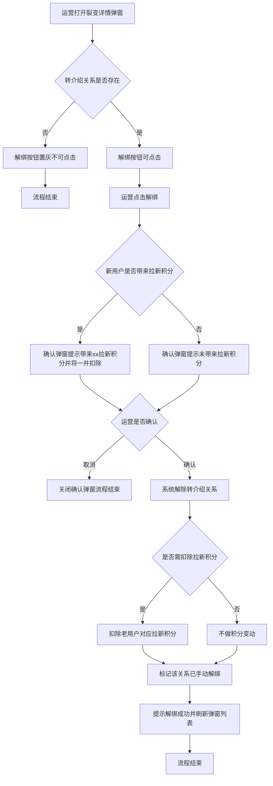
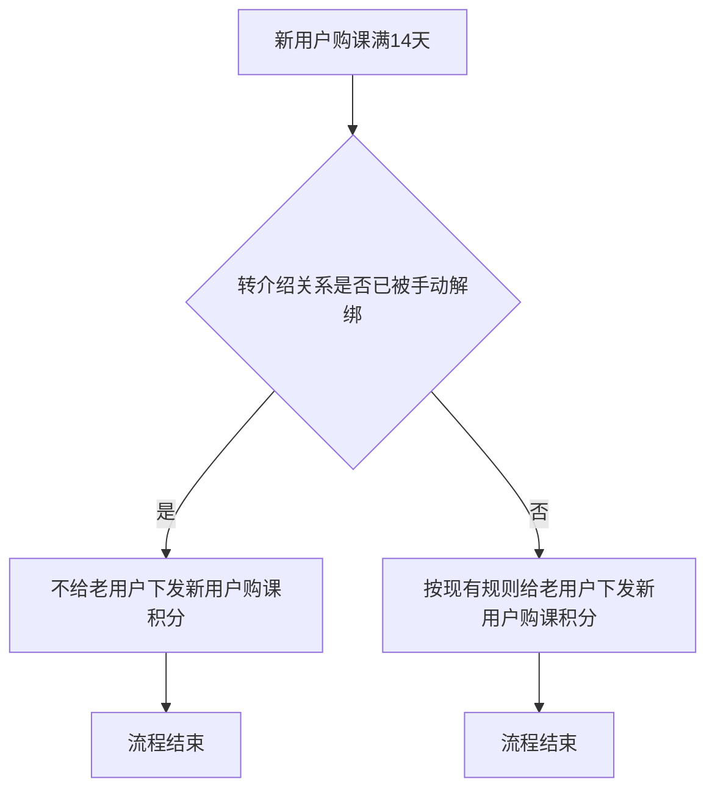

# PRD-裂变详情解绑转介绍关系

## 一、修订记录

| 版本号 | 修改日期 | 修改原因 | 修订人 |
|--------|----------|----------|--------|
| v1.0   | 2026-09-02 | 初稿 | AI PRD Writer |

## 二、需求概述

- **背景/现状**：当电销CRM积分管理的裂变详情弹窗中存在异常或误绑定的转介绍关系时，运营人员无法在系统内解除绑定，也无法回收对应的拉新积分。
- **需求目标**：当转介绍关系存在时，运营人员应能在裂变详情弹窗中一键解绑该关系，并同步扣除已发放的拉新积分。
- **核心逻辑简述**：解绑仅对"转介绍关系存在"的记录开放；解绑时若新用户已带来拉新积分则一并扣除；解绑后新用户购课满14天不再给老用户下发新用户购课积分。

## 三、术语表

| 术语 | 定义 |
|------|------|
| 转介绍关系 | 老用户通过裂变活动邀请新用户后，系统建立的老用户与新用户的绑定关系 |
| 拉新积分 | 新用户被成功邀请后，系统向老用户发放的邀请奖励积分 |
| 新用户购课积分 | 新用户购课满14天后，系统向老用户下发的转化奖励积分 |
| 裂变详情弹窗 | 积分管理列表中点击"裂变新客户数"后弹出的、展示该老用户名下裂变新客户明细的弹窗 |

## 四、调整范围

1. 裂变详情弹窗：新增"操作"栏及"解绑"按钮（含可点击/禁用状态控制）。
2. 解绑二次确认弹窗：新增，含拉新积分扣除提示。
3. 积分逻辑：解绑时同步扣除新用户带来的拉新积分。
4. 购课积分下发逻辑：解绑后拦截"新用户购课满14天给老用户下发新用户购课积分"的发放。

## 五、业务流程图

**解绑转介绍关系流程**

**解绑后购课积分拦截流程**

## 六、可交互原型

在线预览：[点击查看可交互原型](https://pages.yc345.tv/yping-c78bba/fission-unbind/)

> 原型为可交互 HTML 页面，点击链接即可在浏览器中体验完整交互流程。

本地原型文件：`需求汇总/裂变详情解绑转介绍关系/prototype-裂变详情解绑转介绍关系.html`

## 七、功能需求详细描述

### 7.1 【新增】功能

**功能 / 按钮 / 弹窗类**

| 功能名称 | 功能类型 | 是否必填 | 交互说明 | 备注 |
|----------|----------|----------|----------|------|
| 裂变详情弹窗"操作"栏 | 列表栏位 | 不适用 | 在裂变详情弹窗表格最右侧新增"操作"栏，每行展示"解绑"按钮 | 弹窗其余栏位不变 |
| 解绑按钮 | 按钮 | 不适用 | 点击后弹出解绑二次确认弹窗 | 按钮状态见 7.4 |
| 解绑二次确认弹窗 | 弹窗 | 不适用 | 展示确认文案（区分是否带来拉新积分），提供"确认解绑""取消"按钮 | 文案见下方逻辑说明 |

**解绑确认弹窗文案逻辑：**

| 判断条件 | 弹窗提示内容 |
|----------|--------------|
| 新用户已为老用户带来拉新积分 | 该新用户已为老用户带来 xx 拉新积分，解绑后将一并扣除该积分；解绑后新用户购课满14天也不再给老用户下发新用户购课积分。是否确认解绑？ |
| 新用户未带来拉新积分 | 该新用户未带来拉新积分，无需扣除；解绑后新用户购课满14天也不再给老用户下发新用户购课积分。是否确认解绑？ |

**确认解绑后的系统处理：**

1. 解除该老用户与该新用户的转介绍关系，该行"转介绍关系是否存在"更新为"否"。
2. 若新用户已带来拉新积分，从老用户当前积分中扣除对应拉新积分，并生成积分变动记录（沿用现有积分明细记录方式）。
3. 将该关系标记为"手动解绑"，作为后续购课积分拦截依据。
4. 提示"解绑成功"（如有扣除积分，提示中带上扣除的积分数），并刷新弹窗列表。

### 7.2 【修改】功能

| 功能/字段名称 | 修改项 | 改前 | 改后 | 备注 |
|---------------|--------|------|------|------|
| 新用户购课积分下发规则 | 下发前置条件 | 新用户购课满14天后，给老用户下发新用户购课积分 | 新增判断：若转介绍关系已被手动解绑，则不下发 | 未解绑的关系沿用现有规则 |

### 7.4 状态与异常变更

| 涉及位置 | 变更动作 | 触发条件 | 系统行为 / 文案 |
|----------|----------|----------|------------------|
| 裂变详情弹窗-解绑按钮 | 新增 | 该行"转介绍关系是否存在"为"是" | 按钮高亮可点击 |
| 裂变详情弹窗-解绑按钮 | 新增 | 该行"转介绍关系是否存在"为"否"（含已解绑成功后） | 按钮置灰不可点击，鼠标悬浮提示"转介绍关系不存在，不可解绑" |
| 解绑二次确认弹窗 | 新增 | 点击"取消"或关闭弹窗 | 关闭弹窗，不做任何变更 |
| 解绑操作 | 新增 | 解绑请求失败 | 提示"解绑失败，请重试"，关系与积分均不变更 |

## 八、埋点与数据需求

无。

## 九、权限说明

无，沿用积分管理页面现有访问权限。
