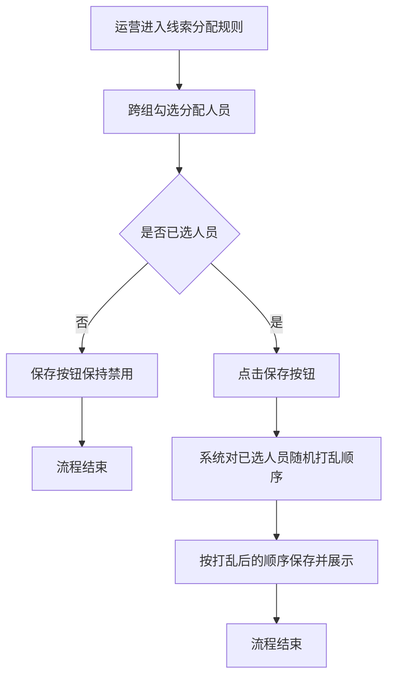
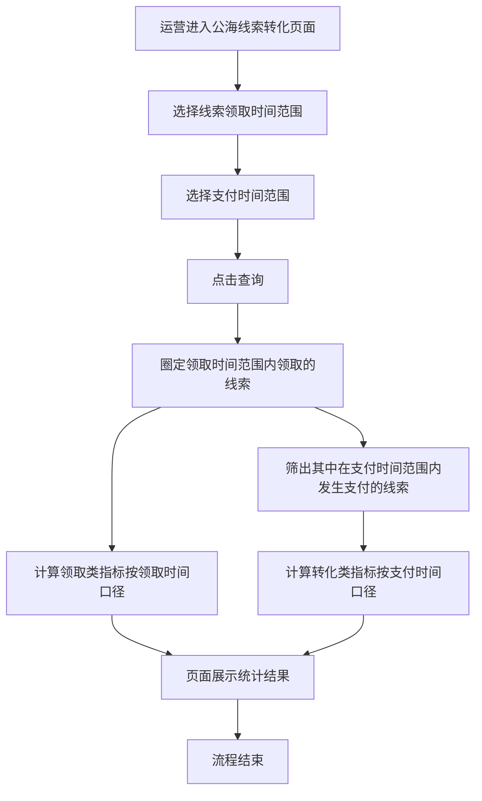

# PRD-体验营线索筛选分配与公海转化优化

## 一、修订记录

| 版本号 | 修改日期 | 修改原因 | 修订人 |
|--------|----------|----------|--------|
| v1.0   | 2026-09-04 | 初稿 | AI PRD Writer |
| v1.1   | 2026-09-04 | 功能详细描述改为按页面组织；明确人员随机打乱发生在选择员工弹窗保存时 | AI PRD Writer |

## 二、需求概述

- **背景/现状**：当线索等级新增 Z 等级后，当期客户高级筛选无法按 Z 等级过滤；线索分配规则保存后人员按组别先后展示，分配顺序存在组别倾斜；公海线索转化仅有单一日期筛选，无法区分领取行为与支付行为的统计口径。
- **需求目标**：当运营使用上述三个模块时，系统应支持按 Z 等级筛选客户、随机化已保存的分配人员顺序，并按领取时间与支付时间双维度统计公海线索转化数据。
- **核心逻辑简述**：公海线索转化的查询逻辑为——在线索领取时间范围内领取的线索中，统计其在所选支付时间范围内发生支付的数据；领取类指标按领取时间口径，转化类指标按支付时间口径。

## 三、术语表

| 术语 | 定义 |
|------|------|
| Z 等级 | 线索等级体系中新增的一个枚举等级 |
| 公海线索 | 未归属具体销售、可由销售主动领取的线索 |
| 大会员净指标 | 剔除退款等因素后的大会员付费统计口径 |

## 四、调整范围

1. 体验营-客户管理-当期客户-高级筛选：线索等级筛选项新增 Z 等级枚举值。
2. 体验营-配置-线索投放计划-线索分配规则：选择人员保存时自动随机打乱人员顺序，不按组别先后展示。
3. 体验营-数据统计-公海线索转化：日期筛选拆分为「线索领取时间」「支付时间」两个筛选项，各指标按对应时间口径查询。

## 五、业务流程图

**流程一：线索分配规则人员保存流程**

**流程二：公海线索转化双时间口径查询流程**

## 六、可交互原型

在线预览：[点击查看可交互原型](https://pages.yc345.tv/yping-c78bba/trial-camp-lead-conversion/)

> 原型为可交互 HTML 页面，点击链接即可在浏览器中体验完整交互流程，覆盖高级筛选 Z 等级、人员随机打乱保存、双时间筛选查询三个场景。

## 七、功能需求详细描述

按页面组织，仅描述本次变更。

### 7.1 客户管理-当期客户（高级筛选）

**【新增】枚举值**

| 字段名称 | 字段说明 | 字段来源 | 备注 |
|----------|----------|----------|------|
| 线索等级-Z级 | 高级筛选抽屉中「线索等级」多选筛选项新增「Z级」枚举值，排列在现有等级之后 | 线索等级体系 | 现有选项（无等级、S级~I级）不变；多选、清空、折叠标签等交互沿用现有配置 |

### 7.2 配置-线索投放计划（线索分配规则）

**【修改】功能**

| 功能名称 | 修改项 | 改前 | 改后 | 备注 |
|----------|--------|------|------|------|
| 选择员工弹窗-保存 | 保存后分配员工列表的展示顺序 | 按选人时组织架构树的组别先后顺序排列 | 弹窗点击「提交」保存时，系统对全部已选人员自动随机打乱顺序后展示 | 每次保存均重新随机；选人弹窗交互、权重、轮循分配、备选员工等既有规则沿用现状 |

### 7.3 数据统计-公海线索转化

**【修改】筛选项**

| 功能名称 | 修改项 | 改前 | 改后 | 备注 |
|----------|--------|------|------|------|
| 日期筛选 | 筛选项结构 | 单一「日期」时间范围筛选 | 拆分为「线索领取时间」「支付时间」两个时间范围筛选项 | 时间控件样式沿用现有配置；领取转化/录入转化两个页签均生效 |

**查询逻辑：**

- 统计对象：在「线索领取时间」范围内被领取的线索。
- 转化判定：上述线索中，在「支付时间」范围内发生支付的数据计入转化类指标。
- 指标口径分组（数据卡片与小组/个人面板同口径）：

| 指标 | 查询时间口径 |
|------|--------------|
| 领取线索量 | 线索领取时间 |
| 人均领取线索量 | 线索领取时间 |
| 添加企微好友数 | 线索领取时间 |
| 人均添加企微好友数 | 线索领取时间 |
| 转化金额 | 支付时间 |
| 转化率 | 支付时间 |
| 大会员净付费人数 | 支付时间 |
| 大会员净转化率 | 支付时间 |
| 大会员净GMV | 支付时间 |
| 大会员净客单价 | 支付时间 |

**状态与异常变更**

| 涉及位置 | 变更动作 | 触发条件 | 系统行为 / 文案 |
|----------|----------|----------|------------------|
| 查询按钮 | 新增校验 | 任一时间筛选项未选择完整起止时间 | 提示"请填写完整的开始和结束时间"，不发起查询 |
| 统计结果 | 新增兜底 | 所选范围内无符合条件的数据 | 各指标展示为 0，页面正常渲染不报错 |

## 八、埋点与数据需求

（无）

## 九、权限说明

（无）
