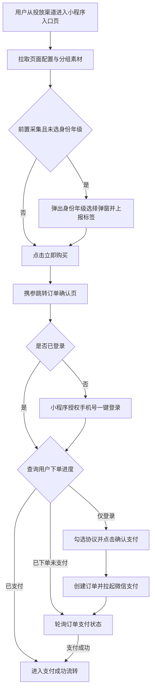
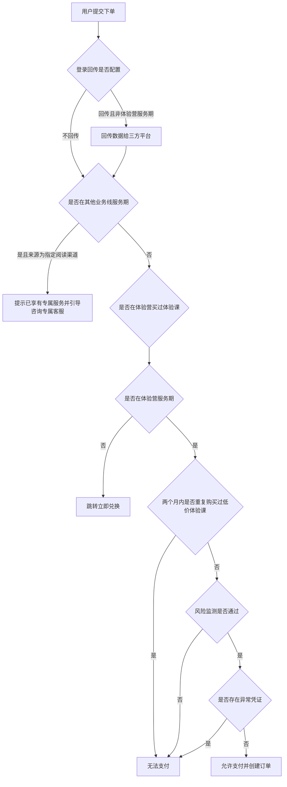
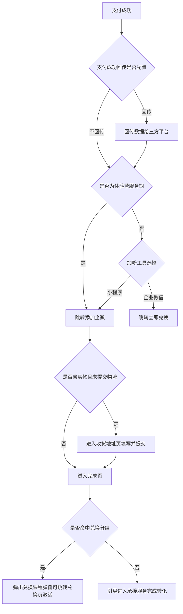

# PRD-体验营投放链路小程序承接

## 一、修订记录

| 版本号 | 修改日期 | 修改原因 | 修订人 |
|--------|----------|----------|--------|
| v1.0   | 2026-09-11 | 初稿 | AI PRD Writer |

## 二、需求概述

- **背景/现状**：体验营投放下单链路目前仅有 H5 版本，小程序端投放场景缺少原生承接能力。
- **需求目标**：将体验营 H5 投放全链路（入口页 → 订单确认 → 收货地址 → 完成页 → 兑换页）复制一份，以原生微信小程序页面承接。
- **核心逻辑简述**：业务逻辑与 H5 保持一致；登录环节改为小程序授权手机号登录，支付仅保留微信支付，下单来源标识更换为小程序体验营专用标识。

## 三、术语表

| 术语 | 定义 |
|------|------|
| 体验营 | 低价体验课营销活动，用户购买后由销售跟进转化 |
| 前置/后置采集 | 身份与年级信息的采集时机：前置在入口页购买前采集，后置在支付完成后采集 |
| 回传 | 将用户注册、下单、支付等转化行为数据同步给投放三方平台，用于投放效果优化 |
| 挽留弹窗 | 用户在页面点击返回时弹出的留资/优惠提示弹窗 |
| 兑换（激活） | 用户对已购买但未生效的课程权益进行确认激活的操作 |
| 加粉工具 | 支付成功后引导用户添加的承接工具，可配置为小程序或企业微信 |

## 四、调整范围

本次为跨端移植型需求，将 H5 体验营投放链路在微信小程序中以原生页面重建，涉及以下模块：

1. **投放入口页**：素材展示、身份/年级选择（含售罄态）、分组素材实验、拼团展示、购买跳转、返回挽留。
2. **订单确认页**：商品与金额展示、小程序授权手机号登录（本次变更点）、协议勾选、下单与微信支付、支付结果轮询、返回挽留。
3. **收货地址页**：地址列表、新增/编辑表单、省市区三级选择、物流信息提交（实物商品时进入）。
4. **完成页**：报名成功展示、身份/年级采集弹窗（后置采集）、购买成功弹窗、兑换课程弹窗、跳转承接服务（仅做新版流程，老版不迁移）。
5. **兑换页与兑换成功页**：登录态校验、待激活订单列表、确认激活、激活成功展示与打开学习端引导。
6. **公共能力**：请求封装、页面间传参、路由跳转、基础弹窗/提示/选择器组件。
7. **埋点与转化回传**：全链路进入/点击/支付成功等埋点事件与三方转化回传，沿用现有事件口径，接入小程序埋点上报。
8. **后端下单接口调整**：下单接口的来源标识枚举新增/更换为小程序体验营专用值 `weappTiyanyingOrder`，用于区分小程序渠道订单（本次变更点）。

## 五、业务流程图

**流程一：小程序端购买主流程**

**流程二：下单前服务端校验流程**

**流程三：支付成功后流转流程**

## 六、可交互原型

在线预览：[点击查看可交互原型](https://pages.yc345.tv/yping-c78bba/tyy-weapp-order/)

> 原型为可交互 HTML 页面，点击链接即可在浏览器中体验完整交互流程（入口页 → 订单确认 → 收货地址 → 完成页 → 兑换页 → 兑换成功页，含身份选择、授权登录、协议二次确认、挽留等弹窗）。

## 七、功能需求详细描述

### 7.1 【新增】功能

本次新增内容为小程序端整套承接页面（业务规则均与现有 H5 保持一致，下表仅列小程序端需新建的功能载体，规则细节沿用现有配置）：

| 功能名称 | 功能类型 | 是否必填 | 交互说明 | 备注 |
|----------|----------|----------|----------|------|
| 小程序投放入口页 | 页面 | 不适用 | 素材展示、身份/年级选择、拼团展示、点击购买携参跳转订单页 | 售罄态、前后置采集、分组素材等规则沿用现有配置 |
| 小程序订单确认页 | 页面 | 不适用 | 商品金额展示、登录、协议勾选、下单支付、支付状态轮询 | 下单风险/限购/服务期等错误提示文案沿用现有配置 |
| 小程序收货地址页 | 页面 | 不适用 | 地址列表选择、新增/编辑表单、省市区三级选择、提交物流信息 | 仅实物商品订单进入；表单校验规则沿用现有配置 |
| 小程序完成页 | 页面 | 不适用 | 报名成功展示、后置采集弹窗、兑换课程弹窗、引导进入承接服务 | 仅实现新版流程，老版流程不迁移 |
| 小程序兑换页 | 页面 | 不适用 | 展示待激活订单列表与活动说明，确认激活后跳转成功页 | 激活中按钮置灰防重复提交；无可激活权益时展示空态提示 |
| 小程序兑换成功页 | 页面 | 不适用 | 激活成功展示，引导打开学习端 | 打开学习端方式改为小程序内引导跳转 |
| 授权手机号登录面板 | 弹窗 | 是 | 点击登录按钮拉起微信授权手机号面板，允许后完成登录 | 用户拒绝授权时提示无法完成登录，可再次发起 |

### 7.2 【修改】功能

| 功能/字段名称 | 修改项 | 改前 | 改后 | 备注 |
|---------------|--------|------|------|------|
| 订单确认页登录方式 | 登录交互 | 手机号输入 + 短信验证码登录（含验证码倒计时、注册判断） | 小程序授权手机号一键登录 | 授权成功后自动完成登录并查询用户下单进度 |
| 支付方式 | 可选支付渠道 | 微信 / 支付宝可选 | 仅微信原生支付，不展示支付方式选择 | 支付宝相关分支全部去除 |
| 下单接口来源标识 | 枚举值 | H5 体验营来源标识 | `weappTiyanyingOrder`（小程序体验营专用） | 用于后端区分小程序渠道订单，回传与风控链路按新标识识别 |
| 返回挽留触发方式 | 触发机制 | 浏览器返回监听 | 小程序返回拦截 | 挽留弹窗内容与按钮沿用现有配置 |
| 完成页跳转小程序引导 | 跳转方式 | 生成二维码 / 复制链接 / 网页跳转小程序 | 小程序内直接页面引导，删除二维码与复制链接逻辑 | 用户已在小程序内，无需跨端跳转 |
| 埋点上报通道 | 上报方式 | H5 埋点上报 | 小程序埋点上报，事件名与字段口径不变 | 转化回传接口沿用现有调用，补齐登录态与设备标识 |

### 7.3 【删除】功能

| 功能/字段名称 | 删除范围 | 影响说明 |
|---------------|----------|----------|
| 短信验证码登录组件 | 手机号输入框、验证码输入框、获取验证码按钮及倒计时 | 由授权手机号登录整体替代，无用户路径缺口 |
| 支付宝支付分支 | 支付方式选择控件及支付宝支付流程 | 小程序内仅微信支付，用户无感知 |
| 电脑端适配逻辑 | 电脑端扫码支付及宽度适配 | 小程序无电脑端场景 |
| 老版完成页流程 | 老版营期完成页整套展示与跳转 | 仅保留新版流程，老版营期不在小程序投放范围 |

### 7.4 状态与异常变更

| 涉及位置 | 变更动作 | 触发条件 | 系统行为 / 文案 |
|----------|----------|----------|------------------|
| 订单确认页-确认支付按钮 | 新增 | 未登录时点击 | 提示"请先微信授权手机号登录"，不发起下单 |
| 订单确认页-确认支付按钮 | 新增 | 已登录但未勾选协议时点击 | 弹出协议二次确认弹窗，点"同意并支付"后自动勾选并继续下单 |
| 授权手机号面板 | 新增 | 用户点击拒绝授权 | 提示无法完成登录，停留当前页可再次发起授权 |
| 下单校验 | 沿用 | 命中风险 / 限购 / 服务期 / 重复购买低价课 / 异常凭证 | 弹窗展示对应错误文案，无法支付；文案沿用现有配置 |
| 收货地址页-提交按钮 | 新增 | 未选择收货地址 | 按钮置灰不可点，选择地址后激活 |
| 兑换页-确认激活按钮 | 新增 | 点击激活后请求处理中 | 按钮置灰展示"激活中"，防重复提交；失败按现有规则自动重试后仍失败则提示错误 |

## 八、埋点与数据需求

全链路埋点事件（进入页面、页面滑动、点击购买、挽留弹窗、勾选协议、确认支付、支付成功、提交地址等约 14 个事件）沿用现有 H5 事件名与字段口径，改由小程序埋点通道上报；短信验证码相关埋点事件随登录方式变更一并下线。三方转化回传（注册、下单、支付成功三个节点）沿用现有回传规则，按新的下单来源标识识别小程序渠道。

## 九、权限说明

无新增权限要求。
