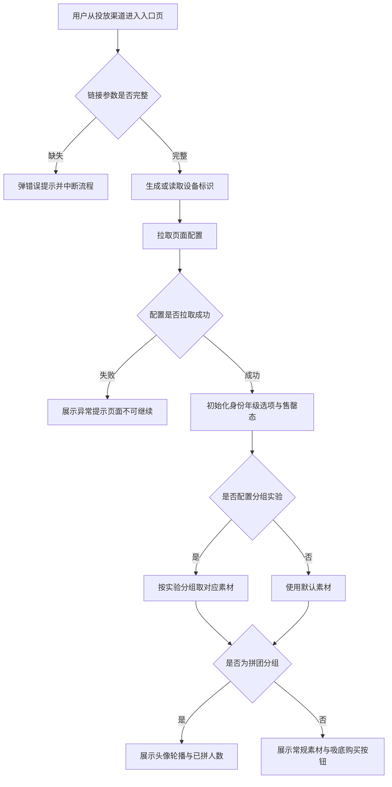
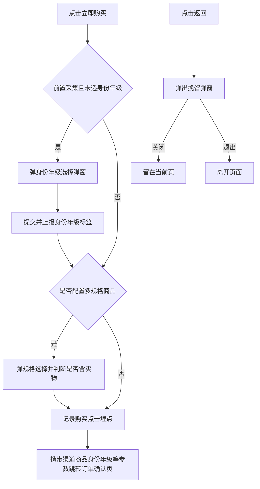
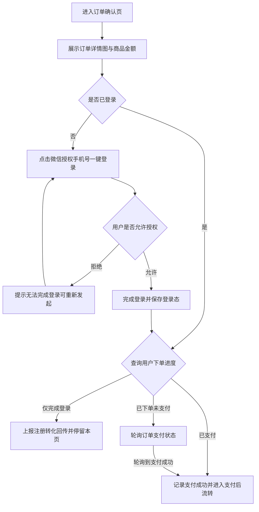
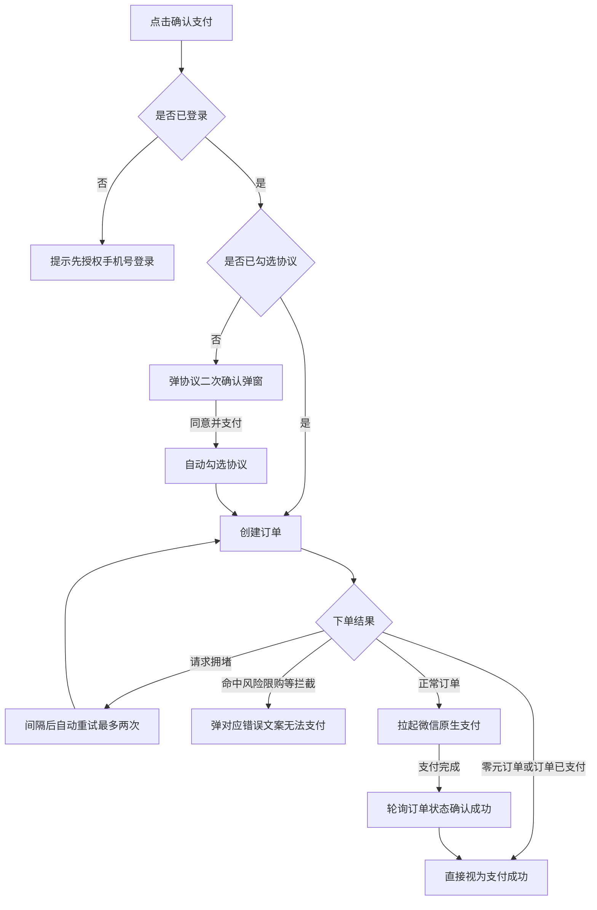
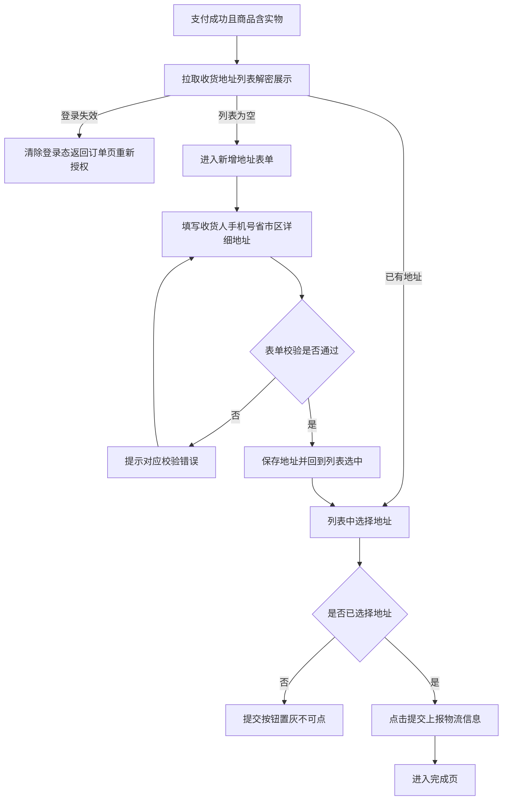
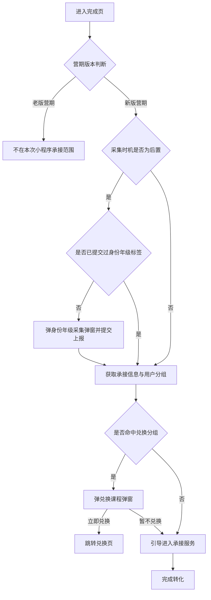
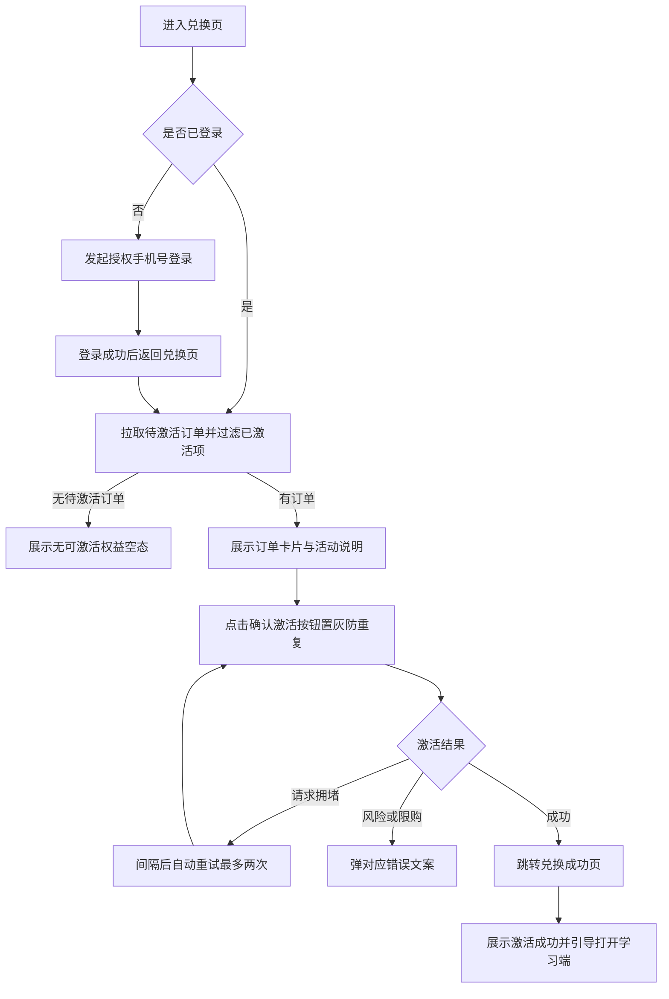
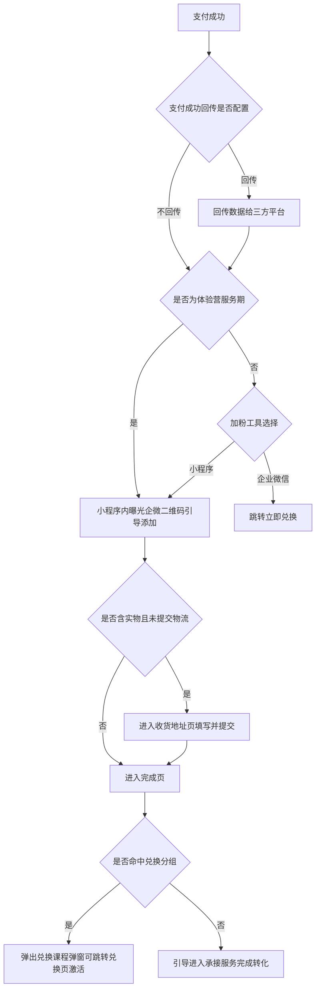

# PRD-体验营投放链路小程序承接

## 一、修订记录

| 版本号 | 修改日期 | 修改原因 | 修订人 |
|--------|----------|----------|--------|
| v1.0   | 2026-09-11 | 初稿 | AI PRD Writer |
| v1.1   | 2026-09-11 | 按前端全链路文档细化各页面流程图与逐步骤逻辑判断 | AI PRD Writer |
| v1.2   | 2026-09-11 | 取消挽留弹窗跳企微链路；添加企微改为小程序内曝光企微二维码 | AI PRD Writer |

## 二、需求概述

- **背景/现状**：体验营投放下单链路目前仅有 H5 版本，小程序端投放场景缺少原生承接能力。
- **需求目标**：将体验营 H5 投放全链路（入口页 → 订单确认 → 收货地址 → 完成页 → 兑换页）复制一份，以原生微信小程序页面承接。
- **核心逻辑简述**：业务逻辑与 H5 保持一致；登录环节改为小程序授权手机号登录，支付仅保留微信支付，下单来源标识更换为小程序体验营专用标识。

## 三、术语表

| 术语 | 定义 |
|------|------|
| 体验营 | 低价体验课营销活动，用户购买后由销售跟进转化 |
| 前置/后置采集 | 身份与年级信息的采集时机：前置在入口页购买前采集，后置在支付完成后采集 |
| 回传 | 将用户注册、下单、支付等转化行为数据同步给投放三方平台，用于投放效果优化 |
| 挽留弹窗 | 用户在页面点击返回时弹出的留资/优惠提示弹窗 |
| 兑换（激活） | 用户对已购买但未生效的课程权益进行确认激活的操作 |
| 加粉工具 | 支付成功后引导用户添加的承接工具，可配置为小程序或企业微信 |
| 分组实验 | 投放素材的分组对照实验，不同分组展示不同素材或购买模式（如拼团） |

## 四、调整范围

本次为跨端移植型需求，将 H5 体验营投放链路在微信小程序中以原生页面重建，涉及以下模块：

1. **投放入口页**：素材展示、身份/年级选择（含售罄态）、分组素材实验、拼团展示、购买跳转、返回挽留。
2. **订单确认页**：商品与金额展示、小程序授权手机号登录（本次变更点）、协议勾选、下单与微信支付、支付结果轮询、返回挽留。
3. **收货地址页**：地址列表、新增/编辑表单、省市区三级选择、物流信息提交（实物商品时进入）。
4. **完成页**：报名成功展示、身份/年级采集弹窗（后置采集）、购买成功弹窗、兑换课程弹窗、跳转承接服务（仅做新版流程，老版不迁移）。
5. **兑换页与兑换成功页**：登录态校验、待激活订单列表、确认激活、激活成功展示与打开学习端引导。
6. **公共能力**：请求封装、页面间传参、路由跳转、基础弹窗/提示/选择器组件。
7. **埋点与转化回传**：全链路进入/点击/支付成功等埋点事件与三方转化回传，沿用现有事件口径，接入小程序埋点上报。
8. **后端下单接口调整**：下单接口的来源标识枚举新增/更换为小程序体验营专用值 `weappTiyanyingOrder`，用于区分小程序渠道订单（本次变更点）。

## 五、业务流程图

全链路按页面拆分为七个前端流程与两个服务端流程，每个流程图后附「步骤逻辑判断表」，逐一列出该环节的判断条件与两种走向。

### 流程一：入口页初始化

**入口页初始化步骤逻辑判断：**

| 步骤 | 判断条件 | 满足时 | 不满足时 |
|------|----------|--------|----------|
| 进入页面 | 投放链接中的页面参数是否存在 | 继续初始化 | 弹错误提示，流程中断 |
| 设备标识 | 本地是否已有设备标识 | 直接读取使用 | 生成新标识并保存本地 |
| 拉取配置 | 页面配置是否返回成功 | 初始化渠道、商品、售罄清单、采集时机、回传比例等 | 展示失败提示长驻，页面不可继续操作 |
| 年级展示方式 | 年级区间配置是否为按年龄展示 | 年级名称替换为对应年龄段 | 按年级名称展示 |
| 身份可选态 | 该身份是否在售罄清单内 | 置灰不可选并展示售罄角标 | 正常可选 |
| 年级可选态 | 该年级是否在售罄清单内 | 置灰不可选并展示售罄角标 | 正常可选 |
| 素材选择 | 页面配置是否包含分组实验编码 | 请求实验分组，按分组展示对应图片、按钮、背景 | 使用默认素材 |
| 拼团展示 | 实验分组是否为拼团分组 | 展示头像轮播与已拼人数，按钮为拼团样式 | 常规购买展示 |
| 挽留启用 | 渠道是否为指定的免挽留小程序渠道 | 不启用返回挽留 | 启用返回挽留 |
| 页面埋点 | 页面是否首次滚动 | 上报一次滑动埋点（防重复） | 不上报 |

### 流程二：入口页购买点击与返回挽留

**购买点击步骤逻辑判断：**

| 步骤 | 判断条件 | 满足时 | 不满足时 |
|------|----------|--------|----------|
| 防重复点击 | 3 秒内是否重复点击购买 | 忽略本次点击 | 继续购买流程 |
| 身份年级校验 | 采集时机为前置且用户未选择身份/年级 | 弹身份年级选择弹窗，提交后上报标签并继续 | 直接进入下一步 |
| 身份弹窗提交 | 身份与年级是否均已选择 | 上报标签并关闭弹窗 | 提示先完成选择，不可提交 |
| 规格判断 | 商品是否配置多规格 | 弹规格选择弹窗，按所选规格判断是否含实物 | 按页面配置直接判断是否含实物 |
| 跳转传参 | — | 携带渠道、商品、回传比例、会话、身份年级、订单详情图等参数跳转订单确认页 | — |
| 返回挽留 | 用户点击返回且挽留已启用 | 弹挽留弹窗并上报弹窗曝光埋点 | 直接返回上一页 |
| 挽留按钮 | 用户点击关闭 / 退出 | 分别：留在当前页 / 离开页面；均上报按钮点击埋点。原"免费领取"跳企业微信链路在小程序端取消（获客助手不支持小程序） | — |

### 流程三：订单确认页登录与用户进度判断

**登录与进度判断步骤逻辑：**

| 步骤 | 判断条件 | 满足时 | 不满足时 |
|------|----------|--------|----------|
| 登录判断 | 本地是否存在有效登录态 | 直接查询用户下单进度 | 需微信授权手机号登录 |
| 授权结果 | 用户是否允许授权手机号 | 获取手机号完成登录 | 提示无法完成登录，停留本页可重新发起 |
| 进度=仅登录 | 用户进度为仅完成登录 | 上报注册转化回传，停留订单页等待支付 | — |
| 进度=已下单未支付 | 用户进度为已下单未支付 | 启动订单状态轮询，轮询到支付成功进入支付后流转 | — |
| 进度=已支付 | 用户进度为已支付 | 记录支付成功埋点，按是否含实物直接进入地址页或完成页 | — |
| 返回挽留 | 用户点击返回 | 弹订单页挽留弹窗（曝光与按钮点击均上报埋点） | — |

### 流程四：订单确认页下单与支付

**下单与支付步骤逻辑判断：**

| 步骤 | 判断条件 | 满足时 | 不满足时 |
|------|----------|--------|----------|
| 登录校验 | 点击确认支付时是否已登录 | 继续协议校验 | 提示先授权手机号登录，不发起下单 |
| 协议校验 | 是否已勾选用户/隐私/儿童隐私协议 | 发起下单 | 弹协议二次确认弹窗；点"同意并支付"自动勾选并继续，点"再想想"留在本页 |
| 下单请求 | — | 携带设备与来源标识（小程序体验营专用标识）创建订单 | — |
| 请求拥堵重试 | 下单返回请求拥堵且重试次数少于 2 次 | 按环境间隔（生产 1 秒 / 其他 5 秒）自动重试 | 超过 2 次按失败处理并提示 |
| 下单拦截 | 命中风险 / 限购 / 服务期 / 未填年级等拦截 | 弹对应错误文案，无法支付 | 继续判断订单类型 |
| 订单类型 | 订单是否为零元订单或已支付订单 | 不拉起支付，直接视为支付成功 | 拉起微信原生支付 |
| 支付结果 | 用户是否完成微信支付 | 每 1.5 秒轮询订单状态，确认成功后进入支付后流转 | 取消支付则停留本页，可重新发起 |

### 流程五：收货地址页

**收货地址页步骤逻辑判断：**

| 步骤 | 判断条件 | 满足时 | 不满足时 |
|------|----------|--------|----------|
| 进入条件 | 支付成功的订单是否含实物且未提交过物流信息 | 进入收货地址页 | 跳过本页直接进入完成页 |
| 登录有效性 | 拉取地址列表时登录态是否有效 | 正常展示列表 | 清除本地登录态，返回订单页重新授权登录 |
| 列表为空 | 用户是否已有收货地址 | 展示列表供选择 | 直接进入新增地址表单 |
| 收货人校验 | 收货人姓名是否填写 | 通过 | 提示填写收货人 |
| 手机号校验 | 手机号是否为 11 位有效号码 | 通过 | 提示手机号格式不正确 |
| 地区校验 | 省市区是否已通过三级选择器选定 | 通过 | 提示选择省市区 |
| 详细地址校验 | 详细地址是否填写 | 通过 | 提示填写详细地址 |
| 提交按钮状态 | 是否已选择收货地址 | 提交按钮激活可点 | 提交按钮置灰不可点 |
| 提交动作 | 点击提交 | 上报购买点击埋点并提交物流信息，成功后进入完成页 | — |

### 流程六：完成页

**完成页步骤逻辑判断：**

| 步骤 | 判断条件 | 满足时 | 不满足时 |
|------|----------|--------|----------|
| 营期版本 | 营期配置是否为老版营期 | 不承接（老版流程不迁移小程序） | 走新版完成页流程 |
| 采集时机 | 采集时机配置是否为后置 | 检查用户是否已提交过身份年级标签 | 直接获取承接信息 |
| 是否已打标 | 用户是否已提交过身份年级标签 | 不再弹采集弹窗 | 弹身份年级采集弹窗 |
| 采集弹窗校验 | 身份是否已选、年级是否已选 1-2 个 | 提交上报标签 | 提示完成选择；年级超过 2 个时提示最多选 2 个 |
| 承接信息 | 获取承接跳转信息与用户分组 | 按分组决定后续引导 | — |
| 兑换分组 | 用户分组是否命中兑换分组 | 弹兑换课程弹窗 | 直接引导进入承接服务 |
| 兑换弹窗按钮 | 用户点击立即兑换 / 暂不兑换 | 分别：跳转兑换页 / 继续引导进入承接服务 | — |
| 防重复跳转 | 5 秒内是否重复触发承接跳转 | 忽略本次触发 | 正常跳转 |

### 流程七：兑换页与兑换成功页

**兑换页步骤逻辑判断：**

| 步骤 | 判断条件 | 满足时 | 不满足时 |
|------|----------|--------|----------|
| 登录校验 | 进入兑换页时是否已登录 | 直接拉取待激活订单 | 发起授权手机号登录，登录后返回本页 |
| 订单过滤 | 订单是否为未激活状态 | 展示在待激活列表中 | 不展示 |
| 空态判断 | 是否存在待激活订单 | 展示订单卡片与活动说明 | 展示"无可激活的权益"空态 |
| 激活按钮状态 | 激活请求是否处理中 | 按钮置灰展示激活中，防重复提交 | 按钮可点 |
| 请求拥堵重试 | 激活返回请求拥堵且重试次数少于 2 次 | 按环境间隔自动重试 | 超过 2 次按失败处理并提示 |
| 激活拦截 | 命中风险 / 限购拦截 | 弹对应错误文案 | 其余错误以轻提示告知 |
| 激活成功 | 激活结果返回成功 | 跳转兑换成功页，展示激活成功与打开学习端引导 | — |

### 流程八：下单前服务端校验

**下单前服务端校验步骤逻辑判断：**

| 步骤 | 判断条件 | 满足时 | 不满足时 |
|------|----------|--------|----------|
| 登录回传 | 登录回传是否配置且用户当前无服务期（无服务期才计为有效回传） | 回传注册数据给三方平台 | 不回传，继续校验 |
| 其他业务线服务期 | 用户是否在其他业务线服务期，且来源为指定阅读类渠道 | 提示"系统检测到您已享有专属服务，无需再次购买，如有疑问可咨询专属客服" | 继续校验 |
| 历史购买判断 | 用户是否在体验营购买过体验课 | 进入服务期判断 | 进入服务期判断（所有渠道线索当前无服务期且购买过体验课的，支持再次购买） |
| 体验营服务期 | 用户是否在体验营服务期内 | 继续后续校验 | 跳转立即兑换（无服务期且买过体验课时，再次购买正常进入体验营服务期并分配销售跟进） |
| 重复购买限制 | 两个月内是否重复购买过十元以下体验课 | 无法支付 | 继续校验 |
| 风险监测 | 阿里云风险监测是否通过 | 继续校验 | 无法支付 |
| 异常凭证 | 是否存在异常登录凭证 | 无法支付 | 允许支付并创建订单 |

### 流程九：支付成功后流转

**支付成功后流转步骤逻辑判断：**

| 步骤 | 判断条件 | 满足时 | 不满足时 |
|------|----------|--------|----------|
| 支付成功回传 | 支付成功回传是否配置（非体验营服务期是否回传另有开关） | 回传支付成功数据给三方平台 | 不回传，继续流转 |
| 体验营服务期 | 本单是否为体验营服务期订单 | 小程序内曝光企微二维码，用户长按识别添加企微 | 按加粉工具配置决定承接方式 |
| 加粉工具选择 | 渠道配置的加粉工具为小程序还是企业微信 | 小程序：曝光企微二维码引导添加；企业微信：跳转立即兑换 | — |
| 添加企微方式 | 是否处于小程序端（获客助手链接不支持小程序） | 以页面内曝光企微二维码形式承接，用户长按识别添加 | —（H5 端维持原获客助手链接方式） |
| 实物判断 | 订单是否含实物且未提交物流信息 | 先进入收货地址页填写提交 | 直接进入完成页 |
| 兑换分组 | 用户分组是否命中兑换分组 | 弹兑换课程弹窗，可跳转兑换页激活 | 引导进入承接服务完成转化 |

## 六、可交互原型

在线预览：[点击查看可交互原型](https://pages.yc345.tv/yping-c78bba/tyy-weapp-order/)

> 原型为可交互 HTML 页面，点击链接即可在浏览器中体验完整交互流程（入口页 → 订单确认 → 收货地址 → 完成页 → 兑换页 → 兑换成功页，含身份选择、授权登录、协议二次确认、挽留等弹窗）。

## 七、功能需求详细描述

### 7.1 【新增】功能

本次新增内容为小程序端整套承接页面（业务规则均与现有 H5 保持一致，下表仅列小程序端需新建的功能载体，规则细节沿用现有配置）：

| 功能名称 | 功能类型 | 是否必填 | 交互说明 | 备注 |
|----------|----------|----------|----------|------|
| 小程序投放入口页 | 页面 | 不适用 | 素材展示、身份/年级选择、拼团展示、点击购买携参跳转订单页 | 售罄态、前后置采集、分组素材等规则沿用现有配置 |
| 小程序订单确认页 | 页面 | 不适用 | 商品金额展示、登录、协议勾选、下单支付、支付状态轮询 | 下单风险/限购/服务期等错误提示文案沿用现有配置 |
| 小程序收货地址页 | 页面 | 不适用 | 地址列表选择、新增/编辑表单、省市区三级选择、提交物流信息 | 仅实物商品订单进入；表单校验规则沿用现有配置 |
| 小程序完成页 | 页面 | 不适用 | 报名成功展示、后置采集弹窗、兑换课程弹窗、引导进入承接服务 | 仅实现新版流程，老版流程不迁移 |
| 小程序兑换页 | 页面 | 不适用 | 展示待激活订单列表与活动说明，确认激活后跳转成功页 | 激活中按钮置灰防重复提交；无可激活权益时展示空态提示 |
| 小程序兑换成功页 | 页面 | 不适用 | 激活成功展示，引导打开学习端 | 打开学习端方式改为小程序内引导跳转 |
| 授权手机号登录面板 | 弹窗 | 是 | 点击登录按钮拉起微信授权手机号面板，允许后完成登录 | 用户拒绝授权时提示无法完成登录，可再次发起 |

### 7.2 【修改】功能

| 功能/字段名称 | 修改项 | 改前 | 改后 | 备注 |
|---------------|--------|------|------|------|
| 订单确认页登录方式 | 登录交互 | 手机号输入 + 短信验证码登录（含验证码倒计时、注册判断） | 小程序授权手机号一键登录 | 授权成功后自动完成登录并查询用户下单进度 |
| 支付方式 | 可选支付渠道 | 微信 / 支付宝可选 | 仅微信原生支付，不展示支付方式选择 | 支付宝相关分支全部去除 |
| 下单接口来源标识 | 枚举值 | H5 体验营来源标识 | `weappTiyanyingOrder`（小程序体验营专用） | 用于后端区分小程序渠道订单，回传与风控链路按新标识识别 |
| 返回挽留触发方式 | 触发机制 | 浏览器返回监听 | 小程序返回拦截 | 挽留弹窗内容与按钮沿用现有配置 |
| 完成页跳转小程序引导 | 跳转方式 | 生成二维码 / 复制链接 / 网页跳转小程序 | 小程序内直接页面引导，删除二维码与复制链接逻辑 | 用户已在小程序内，无需跨端跳转 |
| 埋点上报通道 | 上报方式 | H5 埋点上报 | 小程序埋点上报，事件名与字段口径不变 | 转化回传接口沿用现有调用，补齐登录态与设备标识 |
| 添加企微承接方式 | 承接交互 | 跳转企微获客助手链接添加 | 小程序内曝光企微二维码，用户长按识别添加 | 获客助手链接不支持小程序场景 |

### 7.3 【删除】功能

| 功能/字段名称 | 删除范围 | 影响说明 |
|---------------|----------|----------|
| 短信验证码登录组件 | 手机号输入框、验证码输入框、获取验证码按钮及倒计时 | 由授权手机号登录整体替代，无用户路径缺口 |
| 支付宝支付分支 | 支付方式选择控件及支付宝支付流程 | 小程序内仅微信支付，用户无感知 |
| 电脑端适配逻辑 | 电脑端扫码支付及宽度适配 | 小程序无电脑端场景 |
| 老版完成页流程 | 老版营期完成页整套展示与跳转 | 仅保留新版流程，老版营期不在小程序投放范围 |
| 入口页挽留弹窗-免费领取按钮 | 按钮及其跳转企业微信链路 | 小程序端取消该链路，挽留弹窗保留关闭与退出；添加企微统一由支付成功后的二维码曝光承接 |

### 7.4 状态与异常变更

| 涉及位置 | 变更动作 | 触发条件 | 系统行为 / 文案 |
|----------|----------|----------|------------------|
| 订单确认页-确认支付按钮 | 新增 | 未登录时点击 | 提示"请先微信授权手机号登录"，不发起下单 |
| 订单确认页-确认支付按钮 | 新增 | 已登录但未勾选协议时点击 | 弹出协议二次确认弹窗，点"同意并支付"后自动勾选并继续下单 |
| 授权手机号面板 | 新增 | 用户点击拒绝授权 | 提示无法完成登录，停留当前页可再次发起授权 |
| 下单校验 | 沿用 | 命中风险 / 限购 / 服务期 / 重复购买低价课 / 异常凭证 | 弹窗展示对应错误文案，无法支付；文案沿用现有配置 |
| 收货地址页-提交按钮 | 新增 | 未选择收货地址 | 按钮置灰不可点，选择地址后激活 |
| 兑换页-确认激活按钮 | 新增 | 点击激活后请求处理中 | 按钮置灰展示"激活中"，防重复提交；失败按现有规则自动重试后仍失败则提示错误 |

## 八、埋点与数据需求

全链路埋点事件（进入页面、页面滑动、点击购买、挽留弹窗、勾选协议、确认支付、支付成功、提交地址等约 14 个事件）沿用现有 H5 事件名与字段口径，改由小程序埋点通道上报；短信验证码相关埋点事件随登录方式变更一并下线。三方转化回传（注册、下单、支付成功三个节点）沿用现有回传规则，按新的下单来源标识识别小程序渠道。

## 九、权限说明

无新增权限要求。
